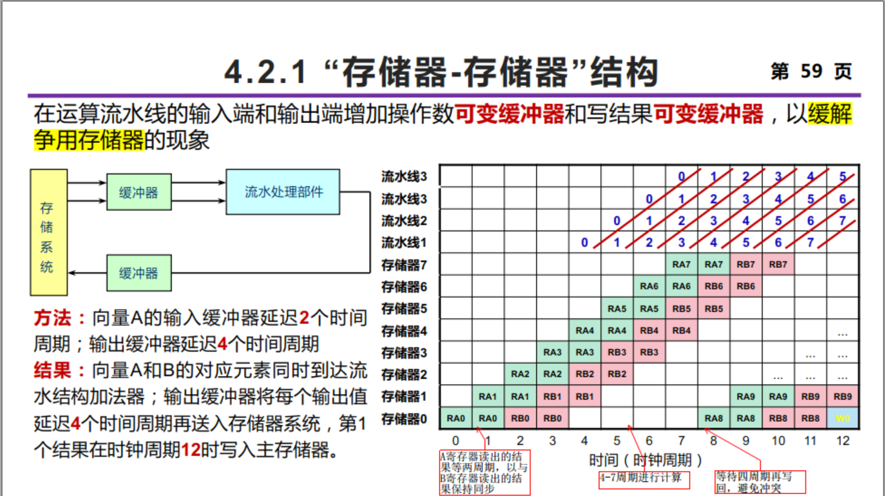
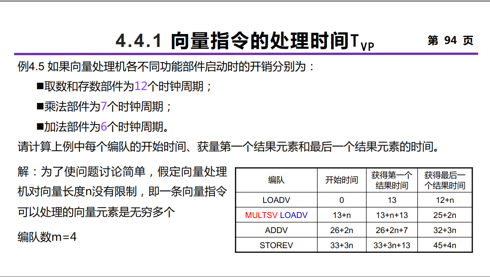

# 
计算机系统结构

## 1.计算机系统结构基础知识

高级语言程序$$\rightarrow$$低级语言程序：**翻译**与**解释**

1. **翻译**：先用转换程序把高一级机器上的程序转换为低一级机器上等效的程序，然后再在低一级机器上运行
2. **解释**：对于高一级机器上的程序中的每一条语句或指令，都是转去执行低一级机器上的一段等效程序。执行完后，再去高一级机器取下一条语句或指令，再进行解释执行。

**微程序**：将一条机器指令编写成一段包含若干条**微指令**的微程序，由硬件来解释执行。

> 微程序是计算机中一种重要的控制单元，它是一个能够控制指令执行顺序和过程、实现各种硬件配置的细小电路。

**Flynn分类法**：按照指令流和数据流的多倍性进行分类，将计算机系统的结构分为4类，为SISD、SIMD、MISD和MIMD

### 1.1计算机系统设计的定量原理

**Amdahl定律**：加快某部件执行速度所能获得的**系统性能加速比**，受限于该部件的执行时间占系统中总执行时间的百分比。
$$
S_n=\frac{T_0}{T_n}=\frac{1}{(1-Fe)+\frac{Fe}{Se}}
$$
其中，$S_n$表示系统加速比，$Fe$表示==可改进比例==，$Se$表示可改进部分的加速比。

由此可得，**设计优化的原则**：==以经常性事件为重点==。

**CPI**：每条指令执行的平均时钟周期数

**IPC**：每个周期执行的平均指令数
$$
CPU时间=执行程序所需的时钟周期数\times时钟周期时间=IC\times CPI\times 时钟周期时间
$$
### 1.2计算机系统的性能评测

**MIPS**（==每秒百万条指令数==）$=\frac{指令条数}{执行时间\times10^6}=\frac{时钟频率}{CPI\times10^6}$

**MFLOPS**（==每秒百万次浮点数操作次数==）$=\frac{程序中的浮点操作次数}{执行时间\times10^6}$

**TOPS**（==每秒万亿操作次数==）$=\frac{处理器的操作次数}{时间\times 10^{12}}$

1. **执行时间**（执行单个程序所花的时间）和**吞吐率**（在单位时间里能够完成的任务）

   > CPU时间：CPU执行所给定的程序所花费的时间，不包含I/O等待时间以及运行其他程序的时间。

2. **基准测试程序**：把应用程序中用得最频繁的那部分核心程序或人工合成出来的程序作为评价计算机性能的标准程序。测试方法很简单，**例如就是单位时间内跑了多少次基准程序**。

   **标准化执行时间的计算方法**：先将各程序的执行时间**对一台参考机器**进行**标准化**，然后取标准化执行时间的**平均值**。（算术平均、几何平均、调和平均）

**并行性**：计算机系统在同一时刻或者同一时间间隔内进行多种运算或操作。只要在时间上相互重叠，就存在并行性。

提高并行性的技术途径：

1. **时间重叠**（==主导作用==）：让多个处理过程在时间上相互错开，轮流重叠地使用同一套硬件设备的各个部分
2. **资源重复**：重复设置硬件资源
3. **资源共享**：软件方法，让多个任务按一定时间顺序轮流使用同一套硬件设备

## 2.指令系统的设计

**指令分类**：包括堆栈、累加器、寄存器-存储器结构以及**寄存器-寄存器结构**（为现代处理器的主流）。

物理地址空间信息存放的两种方式：

1. **允许跨边界存储**：存储效率高，访问速度低
2. **不允许跨边界存储**：存储效率低，访问速度高

### 2.1寻址方式

其中基本寻址方式：

1. **立即数寻址**：立即数$\rightarrow$寄存器
2. **直接寻址**：[偏移地址]$\rightarrow$寄存器
3. **寄存器寻址**：寄存器$\rightarrow$寄存器
4. **寄存器间接寻址**：[基址寄存器]$\rightarrow$寄存器
5. **寄存器相对寻址**：[基址寄存器+偏移量]$\rightarrow$寄存器
6. **基址变址寻址**：[基址寄存器+变址寄存器]$\rightarrow$寄存器
7. **相对基址变址寻址**：[基址寄存器+变址寄存器+偏移量]$\rightarrow$寄存器

指令系统设计的基本原则：**完整性**、**规整性**、**正交性**、**高效率**和**兼容性**。

**间址寻址不能缩短地址码长度**。一般来说，由于RISC指令较为精简，长度较短，用RISC计算机编程比用CISC计算机编程所占程序存储空间更小。

### 2.2指令操作码

#### 2.2.1哈夫曼编码

当各种事件发生的概率不均等时，可以对发生概率最高的事件用最短的位数来表示，而对于出现概率较低的事件，则可以用较长的位数来表示，从而**使总平均位数缩短**。

根据**香农的信源编码定理**，用二进制编码表示$n$个码点时，==理论上的**最短平均编码长度**即为**信息熵**==，也即：
$$
H=-\sum_{i=1}^np_i\log_2p_i
$$
设编码得到的==平均码长==为$L$，则信息冗余量为：
$$
\frac{L-H}{L}\times100\%
$$

信息冗余量越低，说明编码的效率越高。

#### 2.2.2拓展操作码

位于定长二进制编码和哈夫曼编码之间的一种折中编码方案。采用**有限几种固定长度的码长**，仍然采用高概率的用短码，低概率的用长码的哈夫曼压缩思想，使操作码平均长度缩短。

**2-4**扩展操作码：用两位的00、01、10分别用于表示使用频度高的$I_1$、$I_2$、$I_3$，然后**用11作为高位扩展出**4个4位的二进制编码，用于表示剩下的4条指令。

#### 2.2.3等长扩展码

* **15/15/15编码法**：15条4位指令+15条8位指令+15条12位指令
* **8/64/512编码法**：8条4位指令`0xxx`+64条8位指令`1xxx 0xxx`+512条12位指令`1xxx 1xxx 0xxx`

#### 2.2.4定长操作码

所有指令的操作码都是统一的长度，许多计算机都采用这种操作码，以保证操作码的译码速度、减少译码的复杂度。这种操作码是==**以程序的存储空间为代价来换取硬件实现上的好处**。==

* **沿CISC方向发展和改进指令系统**

  CISC应用于通用计算机系统，其指令执行效率高，处理器性能高；而RISC应用于嵌入式计算机系统，其易于硬件实现，易于流水实现和并行处理。

* **沿RISC方向发展和改进指令系统**

  遵循指令条数少、指令功能简单的原则。选用**使用频度高**的指令，在此基础上补充一些最有用的指令。

==数据类型=数据表示+数据结构==

* 数据类型：面向应用、面向软件系统所处理的各种数据结构，例如8、16、32位整型、32、64位浮点型、十进制、字符、字符串等
* 数据表示：硬件结构能够识别、指令系统可以直接调用的那些结构，例如定点数、浮点数

## 3.流水线技术

前提：

1. **空间并行性**：指令操作可以由多个独立的操作部件共同完成
2. **时间并行性**：不同指令可以分时使用同一个部件的不同部分

### 3.1流水线的基本概念

流水线的表示方法：**时——空图**，从时间和空间两个方面描述了流水线的工作过程，横坐标代表时间，纵坐标代表流水线的各个阶段。

一个指令执行过程可以被分解为若干子过程，每个子过程可以与其他子过程同时进行。

* **通过时间**：**第一个**任务从进入流水线到流出结果所需的时间
* **排空时间**：**最后一个**任务从进入流水线到流出结果所需的时间

针对$$k$$段流水线，$$n$$条指令，所需时间为
$$
T=(n+k-1)\cdot\Delta t
$$

$$
\Delta t=\max_i\Delta t_i
$$

因此，**流水线中各段的时间应尽可能相等**，否则时间最长的段将成为流水线的**瓶颈**。

**流水线的分类**：

1. **流水技术的应用等级**

   * 部件级流水线
   * 处理器级流水线
   * 系统级流水线

2. **流水线完成的功能**

   * 单功能流水线：只能完成一种固定功能的流水线
   * 多功能流水线：流水线的各段可以进行不同的连接，以实现不同的功能

3. **同一时间内各段之间的连接方式**

   * 静态流水线：**多功能流水线中的各段只能按同一种功能的连接方式工作**，每次切换功能需要先排空流水线。
   * 动态流水线：**多功能流水线中的各段可以按照不同方式连接，同时执行多种功能**

   **静态流水线在进行功能切换时，要等待前一种运算全部流出流水线后才能进行后面的运算，而动态流水线不需要等待**。

4. **流水线中是否有反馈回路**

   * 线性流水线
   * 非线性流水线：流水线中除了有串行的连接外，还有**反馈回路**

   线性流水线能够用**连接图**唯一表示，而非线性流水线必须用**连接图**和**预约表（时空图）**共同表示。

5. **任务流入和流出的顺序是否相同**

   * 顺序流水线
   * 乱序流水线

6. **处理的数据对象**

   * 标量流水线
   * 向量流水线

### 3.2流水线性能指标

#### 3.2.1吞吐率

$$m$$段流水线：
$$
\mathtt{TP}=\frac{n}{T}=\frac{n}{(m+n-1)\Delta t}
$$

最大吞吐率
$$
\mathtt{TP}_{\max}=\lim_{n\rightarrow\infty}\frac{n}{(m+n-1)\Delta t}=\frac{1}{\Delta t}=\frac{1}{\max_i\Delta t_i}
$$
有$$\mathtt{TP}=\frac{n}{(m+n-1)}\mathtt{TP}_{\max}$$。

解决流水线瓶颈的常用方法：

1. **==细分瓶颈段==**：流水线的段数增加
2. **==重复设置瓶颈段==**：所需的硬件增加，控制逻辑变得复杂

#### 3.2.2加速比

流水线$$T_m=(m+n-1)\Delta t$$，顺序执行$$T_s=nm\Delta t$$，加速比
$$
S=\frac{T_s}{T_m}=\frac{nm}{m+n-1}
$$

$$
S_{\max}=\lim_{n\rightarrow\infty}\frac{nm}{m+n-1}=m
$$

当流水线段数$$m$$增加时，为提高加速比，需要连续输入的任务数$$n$$也必须增加。**注意当流水线段数增加时，需要连续输入的任务数也必须增加**。

#### 3.2.3效率

> ==画出时空图来求解！==

效率指**流水线的设备利用率**，在时空图上，流水线的效率定义为$$n$$个任务占用的时空区与$$m$$个功能段总的时空区之比。
$$
E=\frac{n个任务占用的时空区}{m个功能段的总的时空区}
$$

实际效率
$$
E=\frac{n\cdot\sum_{i=1}^m\Delta t_i}{m\cdot[\sum_{i=1}^m\Delta t_i+(n-1)\cdot\max(\Delta t_1,\Delta t_2,\cdots,\Delta t_m)]}
$$

### 3.3非线性流水线的调度

#### 3.3.1单功能非线性流水线的调度

1. **由预约表得到禁止集合**

   **禁止集合**：非线性流水线的各功能段禁止启动距离（即预约表中每一行**任意两个“$$\times$$”之间的距离**）组合在一起形成的数列。

2. **由禁止集合得到冲突向量**

   **冲突向量**$$C=(C_mC_{m-1}\cdots C_2C_1)$$，若$$i$$在禁止集合中，则$$C_i=1$$，否则$$C_i=0$$。（注意冲突向量的下标从1开始，且从右侧到左侧）

3. **由冲突向量构造调度流水线的状态图**

   1. 将冲突向量作为初始冲突向量送入$$m$$位**逻辑右移**（==左侧补零==）移位器，移位$$m$$次
      * 若移出的是“0”，用当前移位器中的值与**==初始冲突向量==**做**按位或**运算，==得到一个新的冲突向量==。在当前冲突向量与新的冲突向量间连一条有向边，边的值就是移位的次数。
      * 若移出的是“1”，不做任何处理
   2. 将中间形成的每一个新的冲突向量做相同处理。

4. **在状态图中找出可用启动距离，并计算平均启动距离**

   在状态图中**从初始状态出发**，能构成一种**间隔拍数呈周期型重复的方案**，就是**可用启动距离**。找出所有**简单循环**（指状态图中**各冲突向量只经过一次**的启动循环）。

5. **找出平均启动距离最小的启动循环或恒定循环**

   1. ==启动距离：向一条非线性流水线的输入端顺序输入两个任务之间的时间间隔==
   2. ==启动循环：不发生冲突的启动距离一般是一个循环数列，称为非线性流水线的启动循环==
   3. ==恒定循环：只包含一个启动距离的启动循环。==

L.E.Shar，1972：流水线最小平均启动距离的**下限**为**预约表中任意一行里“$$\times$$”的最多个数**。其意义，为预约表中“$$\times$$”最多的行一定是瓶颈流水段。

通过**预留算法**来调度非线性流水线，可以达到最优调度。其核心思想为**插入非计算延迟段**，也即修改预约表以实现最小启动循环。

#### 3.3.2多功能非线性流水线的调度

以双功能为例：

初始结点有两个，分别对应于第一个任务是A类和B类的情况：

* 当第一个任务为A类时，冲突矩阵为$$M^{(0)}_A=\left[\begin{matrix}C_{AA}\\C_{AB}\end{matrix}\right]$$
* 当第一个任务是B类时，冲突矩阵为$$M^{(0)}_B=\left[\begin{matrix}C_{BA}\\C_{BB}\end{matrix}\right]$$

使用$$\texttt{SHR}^{(i)}(M_k)\vee M_r^{(0)}$$来求出后续状态的冲突矩阵，其中$$M_k$$表示当前状态，$$r$$表示下一个流入任务的类型（$$A$$或$$B$$），$$i$$表示**当前状态允许的流入$$r$$型任务的时间间隔**，$$\texttt{SHR}$$表示把当前状态的各冲突向量**逻辑右移**$$i$$位。

### 3.4相关与冲突

#### 3.4.1指令相关

* **数据相关**：后一条指令使用前一条指令的执行结果

  数据相关具有**传递性**。（也称**真数据相关**）

* **名相关**：两条指令使用相同的寄存器，但是它们之间**并没有数据流动**，因此，==如果一条指令中的寄存器名称改变了，并不影响另一条指令的执行==。

  名相关分为两种：

  1. **反相关**：两条指令读取相同的寄存器
  2. **输出相关**：两条指令写入相同的寄存器

  **换名技术**：通过改变指令中操作数的名字来消除名相关，其可以通过编译器静态实现，也可以使用硬件动态完成。

* **控制相关**：由分支指令引起，必须保证程序严格按照控制相关确定的顺序执行

#### 3.4.2流水线冲突

由于相关的存在，指令流中的下一条指令不能在指定的时钟周期执行。

* **结构冲突**：硬件资源满足不了指令**重叠执行**的要求而发生的冲突。

  **可以对功能进行流水或重复设置资源**，或是插入流水线气泡。

* **数据冲突**：当指令在流水线中重叠执行时因需要用到前面指令的执行结果而发生的冲突。可通过**定向技术（数据旁路）**进行解决。

  ==其中，**先写后读**相关在流水线顺序执行和乱序执行时都可能发生，**先读后写**相关和**写写**相关只有在流水线乱序执行时才可能发生。==

* **控制冲突**：流水线遇到分支指令和其他会改变PC值得指令所引起得冲突

  处理分支指令，最简单的方法就是**冻结**或**排空**流水线，也可以通过软件进行预测，或**延迟分支**（**通过编译器调度必须要执行的指令进入延迟槽**）。

### 3.5流水线的实现

理想情况下，流水线在工作时，其中的任务是同步地每个时钟周期往前流动一段。**因此在设计流水线时，要尽可能使各段时间相等**。理想情况下，流水线的**深度越大**，性能越高。

## 4.向量处理机

$$
\begin{cases}
标量处理机\rightarrow向量处理机\\
\texttt{SISD}(单指令多数据)\rightarrow\texttt{SIMD}(单指令多数据)
\end{cases}
$$

数据级（向量数据）的并行，指的是对数组元素同时执行相同的操作，也即在一个向量指令内同时执行多个**同构操作**。**向量处理机**是同时具有**标量数据表示**和**向量数据表示**，以及标量指令系统与向量指令系统的处理机。

### 4.1向量的处理方式

**向量平衡点**：为了使向量硬件设备和标量硬件设备利用率相等，一个程序中向量代码所占的百分比。其关键思想是希望向量硬件和标量硬件都能够被充分利用。

**向量数据的表示方式**

1. **等间距向量表示法**：向量起始地址$$A$$，向量长度$$L$$，向量间距$$f$$。
2. **带位移量的向量表示法**：向量起始地址$$A$$，向量长度$$L$$，向量位移量$$f$$，向量有效长度$$L-f$$，向量起始地址$$A+f$$。
3. **稀疏向量表示法**：对于0元素很多的向量，可以采用压缩存储以节省存储空间。

**向量的处理方式**

1. **横向处理方式**：向量计算是按行的方式从左至右横向地进行
2. **纵向处理方式**：向量计算是按列的方式自上而下纵向地进行
3. **纵横处理方式**：又称分组处理方式，横向处理和纵向处理相结合。向量寄存器的个数通常有限，因此需要进行分组处理。也即，当向量长度$$N$$大于向量寄存器长度$$n$$时，需要分组处理。其中，**组内采用纵向处理方式**，**组间采用横向处理方式**。

### 4.2向量处理机的结构

#### 4.2.1存储器-存储器型结构

采用**纵向处理方式**，利用几个**独立的存储器模块**来支持对独立的数据**并发访问**。

其中，==向量指令的源向量和目的向量都存放在寄存器中，运算的中间结果需要送回存储器。==其存储带宽要求高，可采用**多体交叉并行存储器**，或是**缓冲技术**。

通过在运算流水线的**输入端**和**输出端**增加操作数**可变缓冲器**和写结果**可变缓冲器**，以==缓解争用存储器==的现象。

#### 4.2.2寄存器-寄存器型结构

采用**分组处理方式**，构造一个具有所要求带宽的高速寄存器，实现高速寄存器与主寄存器之间的**快速数据交换**。

典型的寄存器-寄存器结构的向量处理机：美国的CRAY-1，我国的YH-1巨型机。

#### 4.2.3无冲突访问存储器

采用交叉访问方式，采用一个由**n个存储体**构成的主存储器。

* 存储体的个数$$n$$选为**质数**，且$$n\geq$$向量长度，变址移位量就必然与$$n$$互质，一维数组的访问冲突就不存在了。
* $$N\times N$$二维数组无冲突访问存储方案：并行存储体的个数$$m\geq n$$，并且取**质数**，同时还要在行、列方向上错开一定距离存储，设同一列相邻元素在并行存储器中错开$$d_1$$个存储体存放，同一行相邻元素在并行存储器中错开$$d_2$$个存储体存放。当$$m=2^{2p}+1,p\in\mathbb{N}$$时，**能够同时实现按行、按列、按对角线和按反对角线无冲突访问的充要条件是$$d_1=2^p$$，$$d_2=1$$**。
* 对于一个任意$$n\times n$$的数组，如果能够找到满足$$n=2^{2p}$$关系的任意自然数$$p$$，则这个二维数组就能够使用$$n$$个并行存储体实现**按行、列、对角线和反对角线的无冲突访问**。

### 4.3提高向量处理机性能的常用技术

1. **设置多个独立的功能部件**，例如向量部件、浮点部件、标量部件、地址运算部件。这些部件能并行工作，并各自按流水方式工作，从而形成了多条并行工作的运算操作流水线

2. **链接技术**

   两条向量指令占用功能流水线和向量寄存器包括四种情况，分别为**指令不相关**、**功能部件冲突**、**源寄存器冲突**、**结果寄存器冲突**。

   > 需要注意的是，如果两条向量指令的源向量中有相同的向量寄存器，==由于两者的**首元素下标**可能不同，**向量长度**也可能不同，因此这两条向量指令会发生冲突，不能同时执行。==

   具有**先写后读**相关的两条指令，在不出现功能部件冲突和源向量冲突的情况下，可以把功能部件链接起来进行流水处理，以达到加快执行的目的，也即，==将结果寄存器作为后继指令的操作数寄存器==。**这样，当前面功能部件的结果元素一产生，就可以立即被后面的功能部件所使用，而不用==等结果向量全部产生后再来使用==**。

   注意，链接时，**把向量数据元素送往向量功能部件以及把结果存入向量寄存器都需要一拍时间**，**从存储器中把数据送入访存功能部件也需要一拍时间**。

   设通过$$m$$个功能段，每个功能段需要$$t_i$$时间，向量长度为$$n$$，则经过链接后，通过所有功能段的时间为
   $$
   \sum_{i=1}^m(1+t_i+1)+(n-1)=\sum_{i=1}^mt_i+2m+n-1
   $$
   不采用链接时，通过所有功能段的时间为
   $$
   \sum_{i=1}^m(1+t_i+1+n-1)=(\sum_{i=1}^mt_i)+m\cdot(n+1)
   $$

3. **分段开采技术**

   当向量的长度大于向量寄存器的长度时，就必须把长向量分成**长度固定的段**，然后循环分段处理，每一次循环只处理一个向量段。这一分段的技术是由系统自动完成、对程序员透明的。

4. **向量的条件执行**：通过**屏蔽向量**设置写使能，只进行非屏蔽操作。

5. **采用多处理机系统**

### 4.4向量处理机的性能评价

#### 4.4.1向量指令的处理时间$$T_{vp}$$

执行一条向量长度为$$n$$的向量指令所需的时间：
$$
T_{vp}=T_s+T_e+(n-1)T_c=[s+e+(n-1)]\Delta t
$$

其中，$$T_s$$表示向量处理部件流水线的建立时间（也称为*Dead Time*），$$T_e$$表示向量流水线的通过时间（也称为功能部件延迟），$$T_c$$表示流水线的时钟周期时间，每个元素只使用了一个时钟周期。$$(n-1)T_c$$是**所有后续$$(n-1)$$个元素通过流水线所花费的时间**，每个元素只用了一个时钟周期。

如果不考虑$$T_s$$，并令$$T_{start}=e-1$$，则有$$T_{vp}=(T_{start}+n)\Delta T_c$$，其中$$T_{start}$$为**从一条向量指令开始执行到还==差一个时钟周期==就产生第一个结果所需的时钟周期数**，其可称为向量指令的**==启动时间==**，此后，便是**每个时钟周期**流出一个结果，共有$$n$$个结果。

能在同一个时钟周期内一起**开始执行**（==并行运行==）的几条向量指令称为一个**编队**，同一个编队中的向量指令之间一定不存在**流水向量功能部件的冲突和数据的冲突**，编队后，向量指令序列的总的执行时间就为各编队的**执行时间之和**，而一个编队的执行时间由**该编队中各指令的执行时间的最大值来确定**。记$$T^{(i)}_{start}$$为第$$i$$编队中各指令的启动时间的最大值，$$m$$表示编队的个数，则
$$
T_{all}=\sum_{i=1}^mT_{vp}^{(i)}=\sum_{i=1}^m(T_{start}^{(i)}+n)T_c=(T_{start}+mn)T_c
$$
==一个编队的开始执行时间为上一个编队获得最后一个结果的时间+1（需要1周期进行数据传送）==。

一个编队计算一个元素的平均时间定义为**基准时间**$$T_{chime}$$。如果一段程序有$$m$$个编队，且向量长度为$$n$$时，则完成这些向量元素的处理所花的时间近似为$$mnT_{chime}$$

当向量长度$$n$$大于向量寄存器长度$$MVL$$时，就需要**分段开采**，此时会引入一些额外操作，设需要$$T_{loop}$$个时钟周期。设$$p=\lfloor\frac{n}{MVL}\rfloor$$，$$q$$为余数，则处理余数部分需要的时间为
$$
T_{remainder}=T_{start}+T_{loop}+m\times q
$$
其他的，每一次正常循环需要的时间为：
$$
T_{step}=T_{start}+T_{loop}+m\times MVL
$$
因此，总的执行时间为（以时钟周期数为单位）：
$$
T_{all}=T_{step}\times p+T_{remainder}=\lceil\frac{n}{MVL}\rceil(T_{start}+T_{loop})+mn
$$

#### 4.4.2最大性能与半性能向量长度

1. **向量处理机的峰值性能$$R_{\infty}$$**

   $$R_{\infty}$$表示当向量长度为无穷大时，向量处理机（处理浮点数）的最高性能，也称为**峰值性能**：
   $$
   R_{\infty}=\lim_{n\rightarrow\infty}\frac{向量指令序列中浮点运算次数\times 时钟频率}{向量指令序列执行所需的时钟周期数}
   $$
   单位为*Flops*，*MFlops*表示百万次*Flops*。

2. **半性能向量长度$$n_{\frac{1}{2}}$$**

   半性能长度是指向量处理机的性能为其**最大性能的一半**时所需要的向量长度。

3. **向量长度临界值$$n_v$$**

   向量长度临界值：对于某一计算任务，向量方式的处理速度**优于**标量串行方式处理速度时所需的**最小向量长度**。

## 5.指令集并行及其开发——硬件方法

### 5.1指令级并行的概念

$$
\texttt{CPI}_{流水线}=\texttt{CPI}_{理想}+停顿_{结构冲突}+停顿_{数据冲突}+停顿_{控制冲突}
$$

通过减少**结构、数据与控制冲突**，可以使得$$\texttt{CPI}_{流水线}\approx\texttt{CPI}_{理想}$$，通过并行执行两条或两条以上的指令（**指令级并行**），可以进一步减小$$\texttt{CPI}_{流水线}$$。

指令级并行主要针对**基本程序块**以及**分支指令**，**循环级并行**是指令级并行研究的重点之一。

通过代码变换和指令调度可以实现指令级并行，但是必须保持两个关键属性不变：

1. **数据流不变**：数据值从其**产生者指令**到其**消费者指令**的实际流动与原先相同
2. **异常行为不变**：改变指令的执行顺序不能改变程序中**异常**的发生情况

### 5.2指令的动态调度

指令的调度分为**静态调度**与**动态调度**，前者是编译器在编译期间进行代码调度和优化，后者则是在程序的执行过程中，依靠专门硬件对代码进行调度，以减少**相关导致的停顿**。

顺序发射，乱序执行，**需要多个功能部件**。

#### 5.2.1记分牌动态调度算法

目标：==在没有结构冲突时，尽可能早地执行没有数据冲突地指令，实现每个时钟周期执行一条指令。==

> 通过读操作数阶段显式地等待源操作数就绪，解决了RAW冲突。至于WAW冲突以及WAR冲突，需要阻塞。

**记分牌**：硬件维护用于记录指令的三张表：**执行状态表**、**功能部件状态表**、**寄存器状态表**。记分牌负责检测并控制指令的发射和执行。

* **指令状态表**：记录正在执行的各条指令已经进入到了哪一阶段。

* **功能部件状态表**：记录各个功能部件的状态，每个功能部件有一个表项，每个表项由9个字段组成（其中Load/Store使用整数部件Integer）

  | Busy   | Op         | Fi             | Fj           | Fk           | Qj                           | Qk                           | Rj                 | Rk                 |
  | ------ | ---------- | -------------- | ------------ | ------------ | ---------------------------- | ---------------------------- | ------------------ | ------------------ |
  | 忙标志 | 执行的操作 | 目的寄存器编号 | 源寄存器编号 | 源寄存器编号 | 提供源寄存器Fj数据的功能部件 | 提供源寄存器Fk数据的功能部件 | Fj中操作数是否就绪 | Fk中操作数是否就绪 |

* **结果寄存器状态表**：每个寄存器在表中有一项，表示哪个功能部件将把结果写入该寄存器。

记分牌算法中将所有指令划分为如下的四个阶段：

1. **发射**：如果**当前发射指令所需的功能部件空闲**，并且所有其他正在执行的指令目的寄存器与该指令不同（避免**WAW写后写冲突**），记分牌就向功能部件发射该指令。
2. **读操作数**：记分牌监测源操作数的可用性，如果数据可用（避免**RAW写后读冲突**），就通知功能部件从寄存器中读出源操作数并开始执行。
3. **执行**：取到操作数中，功能部件开始执行，产生出结果后就通知记分牌它已经完成执行。注意，**这一段可能要占用多个时钟周期**。
4. **写结果**：如果不存在**WAR读后写冲突**，记分牌就通知功能部件把结果写入目的寄存器，并释放该指令使用的所有资源。

记分牌算法中，因为WAR和WAW的冒险会产生**阻塞**，一旦产生阻塞，**后续相同类型的指令就没法继续发射**。

#### 5.2.2显式动态寄存器重命名

通过寄存器重命名可消除==WAR名相关==、==WAW名相关==。

硬件维护一个映射表，**对于指令中写入的寄存器，为该结构寄存器$$R_i$$分配一个新的物理寄存器$$P_j$$并建立映射关系**；对于指令中读入的寄存器，查找映射表，查找最近一次写寄存器$$R_w$$。

使用该算法，会导致**物理寄存器数量比结构寄存器多**，因此如果没有空闲的物理寄存器，指令会在**发射**阶段停顿。

#### 5.2.3Tomasulo算法

> **按序发射、乱序执行、==乱序==完成**

核心思想：

* 记录和检测指令相关，操作数一旦就绪就立即执行，把发生RAW冲突的可能性减少到最小。
* 通过**隐式寄存器重命名**来消除WAR冲突和WAW冲突。

* **保留站**：每个保留站中保存一条**已经发射并等待到本功能部件执行的指令**，包括**操作数、操作码**以及**用于检测和解决冲突的信息**。在一条指令发射到保留站的时候，如果**该指令的源操作数已经在寄存器中就绪**，就将之取到保留站中；如果**操作数还没有计算出来**，则在**该保留站中记录将产生这个操作数的保留站的标识**（每个保留站都有一个唯一的标识字段）。**只要有对应的保留站空闲**，就==发射==相应指令。
* **公共数据总线CDB**：所有功能部件的计算结果都是送到CDB，**再由其将这些结果直接送到（==广播==）各个需要该结果的地方**。在具有多个执行部件且采用多发射的流水线中，需要采用多条CDB。
* **load缓冲器和store缓冲器**：存放用于计算有效地址的分量；保存正在进行的访存地址，等待存储器响应；保存已经完成了的load的结果/保存该store的地址和数据。

在Tomasulo算法中，**隐式寄存器换名**是通过**保留站和发射逻辑**共同完成的。这称为**隐式寄存器重命名**。==指令发射到保留站中，其操作数寄存器号或者**换成了数据本身**，或者**换成了保留站的标识**，而不再与寄存器有关系，从而消除了WAR冲突和WAW冲突。==

Tomasulo算法的两个优点：

1. **冲突检测逻辑是分步的**（通过**保留站**和**CDB**实现）
2. **消除了WAW冲突和WAR冲突导致的停顿**

**指令执行的步骤**：

1. **发射**：从指令队列的头部取一条指令，如果该指令的操作所要求的保留站空闲，就把该指令送到保留站。如果其操作数在寄存器中已经就绪，就将这些操作数送入保留站，**否则把将产生该操作数的保留站的标识（功能部件）送入保留站**。一旦被记录的功能部件完成计算，它将直接把数据送给保留站。同时，**完成对目标寄存器的预约**。
2. **执行**：当两个操作数都就绪后，本保留站就用相应的功能部件开始执行指令规定的操作。其中，load/store指令的执行需要两个步骤：**计算有效地址**+**把有效地址放入load/store缓冲器**。
3. **写结果**：功能部件计算完毕后，就将计算结果放到**CDB**上，所有等待该计算结果的寄存器和保留站（包括store缓冲器）都同时从CDB上获得所需要的数据。同时，标记本保留站为空闲。

每个保留站有7个字段：

1. Op：对源操作数进行的操作
2. Qj，Qk：将产生源操作数的保留站号，**等于0表示操作数已经就绪且在Vj或Vk中，或者不需要操作数**
3. Vj，Vk：源操作数的值。
4. Busy：为“yes”表示本保留站或缓冲单元“忙”
5. A：仅load和store缓冲器有该字段，初始是存放指令中的**立即数字段**，地址计算后存放有效地址。

同时，还有**寄存器状态表**：用于存放将把结果写入该寄存器的保留站编号，为0表示当前没有正在执行的指令要写入该寄存器，也即**该寄存器中的内容就绪**。

Tomasulo算法中，如果同一时间保留站中多条指令都准备好了，可以通过**FIFO**来决定执行哪条指令。并且，由于Tomasulo算法乱序执行的特点，因此Tomasulo算法**无法实现精确中断**。

#### 5.2.4重排序缓存ROB（Reorder Buffer）

> **按序发射、乱序执行、==按序==完成**

记录下指令在程序中的顺序，一条指令在执行完毕后不会立马提交，而是先在Buffer中等待直到前面的所有指令都提交完毕，才可以提交结果到**逻辑寄存器值**。**顺序提交指令**对实现**精确中断**至关重要。

修改Tomasulo算法，**让CDB总线不再直通逻辑寄存器堆**，而是通到ROB，指令需要从ROB读取数据。

指令在发射时，进入ROB中维护的FIFO队列，只有在其之前的所有指令都提交，该指令才能提交。

其包含6个位：

1. Entry：ROB在每条指令发射时为其分配的编号，该编号可以取代保留站编号
2. Busy：某一行是否保存有指令
3. Instruction：保存的具体指令
4. State：保存的指令当前的运行情况，ROB就是通过State的信息来判断某条指令是否可以提交
5. Destination：指令的目的寄存器
6. Value：指令的结果。指令提交时，就是提交Value到逻辑寄存器。

==注意，指令在写回时会同时写入ROB和保留站，只有在提交时才会写入寄存器堆==。

#### 5.2.5动态分支预测技术

对于一条有$$k$$个流水段的流水线，在最坏情况下每一次条件转移（条件分支）指令将造成$m$个时钟的“停顿”；假设条件转移指令在一般程序中所占的比例为$$p$$，转移成功的概率为$$q$$，则$$n$$条指令的总执行时间为：
$$
T_{K-IF}=(n+k-1)\cdot\Delta t+p\cdot(1-q)\cdot n\cdot m\cdot\Delta t
$$

减少分支指令带来的影响：

* **软件解决方案**
  1. 减少分支：循环展开
  2. **提前形成条件码**
  3. **延迟转移**（delay slot）——编译技术
* **硬件解决方案**
  1. 减少分支：循环展开——Tomasulo算法
  2. **延迟转移**（delay slot）——Flush技术
  3. **推测执行或分支预测**

**分支预测**：

* **分支现场的保护与恢复**：

  1. 只进行指令译码和准备好运算所需的操作数，在转移条件没有形成之前不执行运算
  2. 一直执行到运算完成，但不送回运算结果
  3. 把可能被破坏的原始状态都用后援寄存器保存起来
  4. 设置两个**指令目标缓冲栈**，一个按照分支转移成功方向预取指令，另一个按照转移不成功方向预取指令。

* **静态预测**：程序实际执行过程中，**转移猜测的方向不能改变**。由程序员和编译程序将发生概率高的分支安排在猜测方向。

* **动态预测**

  1. **分支预测缓冲器**：也称为**分支历史表**，进行预测时只依赖本条件转移指令的历史信息（**局部信息**）。在执行条件转移指令时，将转移成功或不成功的信息记录在该存储器中相应表项中，当下次再执行到该条件转移指令时，**转移预测逻辑就根据记录的信息来预测是否转移**。

     根据表项的大小，分支预测缓冲器分为**1-bit转移预测缓冲器**、**2-bit转移预测缓冲器**（连续两次预测错才换方向）、**n-bit转移预测缓冲器**（连续$$2^{n-1}$$次预测错才换方向）。

     注意，其只判断分支是否成功，而无法得到预计的分支目标地址。因此在经典的5段流水线中，该方法不会带来好处。

  2. **相关转移预测器**：依靠已经发生过的**其他条件转移指令**的历史信息（**全局信息**）来进行预测。

     $$(m,n)$$预测器：根据前$$m$$次其他条件转移指令的行为去从$$2^m$$个n-bit预测器中进行选择。也即，**每个条件转移指令需要设置$$2^m$$个n-bit预测器，分别用于前$$m$$次其他条件转移指令的$$2^m$$个行为的预测**。

  3. **分支目标缓冲器BTB**：将分支成功的**分支指令的地址**和它的**分支目标地址**都放到一个缓冲区中保存起来，缓冲区以分支指令的地址为标识。

     ==分支历史表也可以综合进BTB中，提高分支预测的准确率。==

  4. **基于硬件的前瞻（Speculation）执行**：假设对分支指令的猜测总是对的，按照猜测结果继续取、发射和执行后续的指令，**只是执行指令的结果不是写回到寄存器或存储器，而是写入ROB中，等到相应的指令得到确认，才将结果写入寄存器或存储器。**

### 5.5多指令发射技术

多指令发射：在每个时钟周期内发射多条指令，CPI<1。

两种风格：

1. **超标量**：在每个时钟周期发射的指令条数不固定，依代码的具体情况而定，设这个上限为$$n$$，则称该处理机为**n-发射**。

2. **超长指令字VLIW**

   在每个时钟周期发射的指令条数是固定的，这些指令构成一条长指令或者一个指令包。指令之间的并行性是通过指令**显示地**表示出来的。

#### 5.5.1基于静态调度的多发射技术

指令**按序发射**，在发射时，由**硬件检测**==当前发射的指令之间==（**发射包**内的冲突检测）以及==当前发射的指令与正在执行的指令之间==是否有**冲突**。

#### 5.5.2基于动态调度的多发射技术

扩展Tomasulo算法以支持双发射超标量流水线。其中，每个时钟周期发射两条指令，一条是整数指令，另一条是浮点指令。可以将整数所用的表结构与浮点用的表结构分开，分别进行处理。但是，指令的**发射效率高**，不意味着**执行效率**也高。

#### 5.5.3超长指令字技术

把能并行执行的多条指令组装成一条**很长的指令**，设置**多个功能部件**。再将指令字分割成一些字段，每个字段称为一个**操作槽**，直接独立地控制一个功能部件。

再VLIW处理机中，在指令发射时不需要进行**负责的冲突检测**，而是依靠**编译器**就全部处理好了。

#### 5.5.4超流水线处理机

对于一台每个时钟周期能发射n条指令的超流水线计算机来说，这n条指令不是同时发射的，而是每隔1/n个时钟周期发射一条指令。通常把指令流水线级数不少于8的流水线处理机称为**超流水线处理机**。

## 6.指令级并行及其开发——软件方法

### 6.1基本指令调度及循环展开

**指令调度**：找出不相关的指令序列，让它们在流水线上**重叠并行执行**。制约编译器指令调度的因素包括**程序固有的指令级并行水平**以及**流水线功能部件的延迟**。

通过在编译时重新安排指令的发射顺序，尽可能少地引起**流水线空转**，进而缩短整个指令序列的执行时间。

在基本指令调度方法中，**指令调度不能跨越分支指令**，但是，==将指令调度到分支指令的延迟槽中不属于跨越分支指令的情况==。通过**==循环展开==**，使得指令调度得以跨越分支边界，且提高整个执行过程中有效操作的比例。并且，用于判断的**分支指令**数量减少。

> 在**循环展开**与**指令调度**中，需要保证**正确性**（对循环控制和操作数偏移量进行必要的修改）以及**有效性**（只有找到不同循环体之间的无关性才能有效使用循环展开），同时需要重新分配寄存器以避免产生新的冲突。

### 6.2跨越基本块的静态指令调度

**全局指令调度**：优化含有分支结构的循环体需要在多个基本块间移动指令。需要确定各个基本块的**执行频率**，以及调度指令后是否会产生错误结果，还有是否需要向其他基本块中增加**补偿代码**。

**关键路径**：根据指令间的相关关系构成的数据流图中**延迟最长**的路径。

* **踪迹调度**：优化==执行频率高==的**踪迹**，减少其执行开销。而对于执行频率较低的踪迹，其开销反而会有所增加。因此仅当**不同踪迹的执行频率差别较大且各条踪迹的执行频率受输入集的影响较小（也即补偿代码小）时，效果较好**。

  > **踪迹**（trace）：程序执行的指令序列，通常由一个或多个基本块组成。**踪迹内可以有分支，==但一定不能包含循环==**。

  分为两步，**踪迹选择**和**踪迹压缩**

  * **踪迹选择**：从程序的控制流图中选择**执行频率较高**的路径，每条路径就是一条**踪迹**。对于循环结构，则采用**循环展开**；对于**分支结构**，则根据典型输入集下的运行统计信息，若转移成功（或失败）的概率高，则**视作转移总是成功（或失败）**。
  * **踪迹压缩**：**对已生成的踪迹进行指令调度和优化**，尽可能地缩短其执行时间。当跨越踪迹内部的入口或出口进行调度指令时，有时还需要增加**补偿代码**，以确保执行结果的正确性。

  踪迹调度能够提升性能的最根本原因在于**选出的踪迹都是执行频率很高的路径**，减少它们的执行开销有助于缩短程序的总执行时间。但是需要注意，**补偿代码的开销**很有可能降低踪迹调度的优化效果。

* **超块调度**

  在**踪迹调度**中，如果踪迹入口或出口位于踪迹内部，编译器生成补偿代码的难度将大大增加，而且编译器将很难评估这些补偿代码究竟会带来多少性能损失。

  因此，定义**超块**：**只能拥有一个入口**，但可以拥有多个出口。

### 6.3静态多指令发射：VLIW技术

把同时发射的或者满足特定约束的一组操作打包在一起，得到一条更长的指令。在VLIW处理器中，**==相关检测和指令调度工作全部由编译器完成==**，因此它需要更加“智能”的编译器。

**显示并行指令计算EPIC**：由于指令级并行主要由编译器负责开发，处理器为保证代码正确执行提供必要的硬件支持。因此，系统结构必须提供某种**通信机制**，使得流水线硬件能够了解编译器“安排”号的指令执行顺序。

### 6.4挖掘更多的循环级并行

#### 6.4.1循环携带相关

循环携带相关是指一个循环的某个迭代中的指令与其他迭代中的指令之间的数据相关，会大大限制循环展开的效果。

#### 6.4.2存储别名分析

GCD测试法：用$$a\times j+b$$将数组A的一个元素写入存储器，用下标$$c\times k+d$$将数组A的一个元素从存储器中读出，如果$$GCD(c,a)$$可以整除$$(d-b)$$，那么有可能存在存储别名；否则，一定没有存储别名的存在

#### 6.4.3数据相关分析

编译器会将识别出的数据相关进一步细分为**真数据相关**、**输出相关**和**反相关**等不同类型。

## 7.存储系统

层次结构的存储系统：离CPU越近，存储器容量越小，但访问速度越快；离CPU越远，存储器容量越大，但访问速度越慢。

**程序访问的局部性**：

1. **时间局部性**：一个数据或指令被访问，近期内它被再次访问的概率很大
2. **顺序局部性**：除转移类指令外，大部分指令是**顺序进行的**
3. **空间局部性**：一个数据被访问，近期内它附近的数据被再次访问的概率很大

假设$$M_1$$是$$M_2$$的真子集，所有的数据都能在$$M_2$$中找到，访问方式如下：先访问$$M_1$$，如果在$$M_1$$中没有找到，则访问$$M_2$$，再把数据提供给处理器。

命中率：
$$
H=\frac{N_1}{N_1+N_2}
$$
**平均访问时间**：
$$
T=H\cdot T_1+(1-H)\cdot T_2
$$
注：这里的$$T_2$$有时还包括从$$M_2$$中取出数据再写入$$M_1$$的时间。

**存储系统的访问效率**：
$$
e=\frac{T_1}{T}=\frac{T_1}{H\cdot T_1+(1-H)\cdot T_2}
$$

**缺失开销$$T_M$$**：从向$$M_2$$发出访问请求到把**整个数据块调入$$M_1$$中**所需的时间。从而平均访问时间$$T_A=T_1+FT_M$$。

### 7.1Cache

Cache按块进行管理，**Cache和主存均被分割成大小相同的块**，信息以块为单位调入Cache。

* Cache Line：一个Cache条目，包括Tag，数据块等
* Cache Block：Cache中的数据块

**Cache查找策略**：

1. **全相连**：主存中的任意一块都可以映像到Cache中的任意一块。其**空间利用率最高，冲突概率最低**，但是实现起来代价相对较大。

2. **$$n$$-way组相联**：n称为相联度，n-way表示主存中的任意一块可以映像到Cache中n块中的任意一块。设Cache组数为$$G=2^g$$（每组中包括n个Cache块），则低g位以及直接映像中的低m位通常被称为**索引**。

   ==相联度越高，Cache空间的利用率就越高，块冲突概率就越低，缺失率也就越低，但是相应的实现代价也会越高==。

   Cache的容量=组数$$\times$$路数$$\times$$块大小

3. **直接相联**：主存中的每一个块只能被放置到Cache中唯一的一个位置。其硬件实现简单，但是**空间利用率最低，冲突概率最高**。

**Cache写策略**：

**写缓冲器**：提高写访问的速度，为==按字寻址==的。当进行写入操作时，如果写缓冲器不满，就将数据和完整的地址写入缓冲器。同时需要进行**写合并检查**，即**检查本次写入数据的地址是否与缓冲器内某个有效块的地址匹配**，如果匹配，可以直接将新数据与该块合并。当然，如果写缓冲器满且又没有能进行写合并的项，就必须等待。

通过采用写缓冲器可以**减少写停顿**。

* **==写命中==时的策略**：（==写入Cache时是否需要写入主存==）

  1. **写直达法**：CPU在执行写操作时，将数据同时写入Cache和主存
  2. **写回法**：CPU数据只写入Cache，不写入主存，**仅当替换时才将修改过的Cache块写回到主存**

* **写缺失时的策略**：（==写入主存时是否需要写入Cache==）

  1. **写不分配法**：在写Cache缺失时，直接将所要写的字写入主存，不写入Cache

  2. **写分配法**：在写Cache缺失时，除了将所要写的字写入主存，还要将包括所写字在内的**一个块**从主存**读入**Cache，一般常结合**写回法**。

     > 若写回法搭配写不分配法，则写未命中时会直接修改主存中的内容，若一直有新的写入会一直修改主存；若搭配写分配法，则写未命中时会调入Cache，之后新的写会直接修改Cache，直到被替换后再写入主存。==因此写回法常常搭配写分配法==。

**Cache替换策略**：

1. **随机法**
2. **先进先出FIFO法**：设置替换计数器，装入或替换时将所有的计数器值加一，需替换时，替换掉组内计数器值最大的块。
3. **最近最少使用法LRU**：**选择近期最少被访问的块**作为被替换的块，也就是选择**最久没有被访问过的块**。

==CPU时间=（CPU执行周期数+存储器停顿周期数）$$\times$$时钟周期时间==

==存储器停顿周期数=访存次数$$\times$$缺失率$$\times$$缺失开销==

> ==注意访存次数不光是`load`、`store`指令中的访存！还有读取每条指令时的访存==。

### 7.2降低Cache缺失率

1. **强制性缺失**：也叫冷启动缺失。当第一次访问一个块时，该块不在Cache中，需要从下一级存储器中调入Cache$$\longrightarrow$$==增加块大小、预取==
2. **容量冲突**：程序执行时需要的块不能**全部**调入Cache中。当某些块被替换后，若又重新被访问，就会发生缺失$$\longrightarrow$$==增加容量==
3. **冲突缺失**：**在组相联或直接映象Cache**中，若太多的块映象到同一组中，就会出现该组中某个块被替换（**即使别的组还有空闲位置**），然后又被重新访问的现象$$\longrightarrow$$==提高相联度==

可以得到几个结论：

1. **相联度越高，冲突缺失就越小**
2. **强制性缺失和容量缺失不受相联度的影响**
3. **强制性缺失不受Cache容量的影响，但容量缺失当然会随着容量的增加而减少**

#### 7.2.1增加Cache块大小

对于给定的Cache容量，当块大小增加时，缺失率开始下降，后来反而上升：这是因为，增加块大小减少了强制性缺失，但由于容量有限，块大小增加会导致块的数目减少，从而增加冲突缺失。且，**增加块大小会增加缺失开销**。

#### 7.2.2增加Cache容量

可以降低缺失率，但是缺点是增加了成本，同时可能增加了命中时间。

#### 7.2.3提高相联度

==提高相联度会**增加命中时间**==。

2：1Cache经验规则：**容量为N的直接映象Cache的缺失率和容量为N/2的==两路组相联==Cache的缺失率差不多相同**。

#### 7.2.4伪相联Cache（Way预测）

通过保留额外的位来预测一个Set中的路或块，将直接映射的快速命中时间与2-way组相联的低冲突率缺失率相结合。

由于变化的命中时间对CPU流水线影响大，因此伪相联Cache更适合离CPU远的Cache。

#### 7.2.5预取

* **硬件预取**：指令和数据都可以预取，预取内容既可以放入Cache，也可以放入外缓冲器中，例如指令流缓冲器
* **编译器控制的预取**：在编译时加入预取指令，在数据被用到之前提前发出预取请求，可以将数据预取到**寄存器**或是**Cache**中。预取数据是**非阻塞的**，也就是说，CPU应当能够继续执行。

#### 7.2.6编译器优化

1. **内外循环交换**
2. **分块**：把对数组的整行或整列访问改为按块进行，需要计算Cache能容纳下的子矩阵
3. **循环融合**：将若干个独立的循环融合为单个的循环，这些循环访问相同的内存单元，这能使得读入Cache的数据在被替换出去之前，能得到反复的使用

#### 7.2.7牺牲者Cache

在Cache和它从下一级存储器调数据的通路之间设置一个**全相联的小Cache**，称为牺牲者Cache，用于**存放被替换出去的块**，==以备重用==。其对于减少**冲突缺失**很有效。

### 7.3减少Cache缺失开销

==$$平均访存时间=命中时间_{L1}+缺失率_{L1}\times缺失开销_{L1}$$==

==$$缺失开销_{L1}=命中时间_{L2}+缺失率_{L2}\times缺失开销_{L2}$$==

* **局部缺失率**=该级Cache的缺失率/**到达该级Cache的访问次数**
* **全局缺失率**=该级Cache的缺失次数/**CPU发出的访存总次数**

衡量第二级Cache时，应使用**全局缺失率**这个指标。由于第二级Cache容量一般较大，因此其缺失主要为强制性缺失和冲突缺失，从而**第二级Cache可采用较高的相联度或伪相连方法**，同时可采用较大的块。

注意，在读缺失时，所读单元的**最新值**可能还在**写缓冲器**中，因此读缺失时还需要**检查写缓冲器中的内容**。此时可以==让读缺失优先于写==，否则的话，推迟读缺失的处理，就需要先写入主存，这会增加读缺失的开销。

#### 7.3.1请求字处理技术

从下一级存储器调入Cache的块中，只有一个字是立即需要的，这个字称为**请求字**。因此，应尽早将请求字发送给CPU，可以一旦请求字到达就发送（**尽早重启动**），也可以调块时直接从请求字所在的位置读取（**请求字优先**）。

#### 7.3.2非阻塞Cache

Cache缺失时仍允许CPU进行其他的命中访问（指其他的load/stroe等访存相关的操作）。可以同时处理的缺失次数越多，所能带来的性能上的提高就越大。

### 7.4减少命中时间

* **物理Cache**：使用物理地址进行访问。其**地址转换**和**访问Cache**==串行==进行，访问速度很慢
* **虚拟Cache**：使用虚拟地址进行访问。在命中时不需要地址转换。即使缺失，地址转换和访问Cache也可以并行进行，其速度较快。
* **Cache访问流水化**：将Cache的访问过程分成多个流水段，需要多个时钟周期才可以完成。

### 7.5并行主存系统

并行主存系统是在一个访存周期内能并行访问多个存储字的存储器，其能有效提高存储器的带宽。

* **单体多字存储器**：存储器能够每个存储周期读出m个CPU字，因此其最大带宽提高到原来的m倍。但是，其一次取出的m个数据不一定都是有用的，且**其写入有可能变得复杂**。

* **多体交叉存储器**：由m个**单字存储体**构成，每个存储体有自己的地址寄存器以及地址译码和读/写驱动电路

  1. **高位交叉编址**：对存储单元矩阵按列优先的方式进行编址，其同一个存储体中的==高$$\log_2m$$位==都是相同的。特点：**时间局部性好，且方便扩容**。
  2. **低位交叉编址**：对存储单元按行优先的方式进行编址，其同一个存储体中的==低$log_2m$位==都是相同的。特点：**可以并行地取出多条指令，有效地解决访问冲突问题**。

  增加m的值就能增加主存储器的带宽。但是，由于存在访问冲突，实际加速比小于m。

**存储体冲突**：两个请求要访问同一个存储体。通过设置存储体个数为质数，以及软件方法（循环交换优化）等可以解决。

## 9.互连网络

**互连网络**：开关元件按一定**拓扑结构**和控制方式构成的网络以实现计算机系统内部多个处理机或多个功能部件间的**相互连接**。

### 9.1互连函数

互连函数通过数学表达式建立**输入端号**与**输出端号**的连接关系。互连函数$$f(x)$$有时可以采用循环表示，即$$(x_0\space x_1\space\cdots\space x_{j-1})$$，其中$$j$$称为该循环的长度，其表示$$f(x_0)=x_1,f(x_1)=x_2,\cdots,f(x_{j-1})=x_0$$。

==注意输入端和输入端的二进制编号的区别！==

1. **恒等函数**：实现同号输入端和输出端之间的连接
   $$
   I(x_{n-1}x_{n-2}\cdots x_1x_0)=x_{n-1}x_{n-2}\cdots x_1x_0
   $$

2. **交换函数**：实现==二进制地址编码中第$k$位==互反的输入端与输出端之间的连接
   $$
   E(x_{n-1}x_{n-2}\cdots x_{k+1}x_kx_{k-1}\cdots x_1x_0)=x_{n-1}x_{n-2}\cdots x_{k+1}\bar{x}_kx_{k-1}\cdots x_1x_0
   $$
   其主要用于构造**立方体互连网络**和各种**超立方体互连网络**。

   例如，$$N=8$$时，$$n=3$$，几种常用的立方体互连函数如下：
   $$
   \begin{cases}
   Cube_0(x_2x_1x_0)=x_2x_1\bar{x}_0\\
   Cube_1(x_2x_1x_0)=x_2\bar{x}_1x_0\\
   Cube_2(x_2x_1x_0)=\bar{x}_2x_1x_0
   \end{cases}
   $$

3. **均匀洗牌函数**：将==输入端==分成数目相等的两半，前一半和后一半按类似**均匀混洗扑克牌**的方式交叉地连接到输出端。
   $$
   \sigma(x_{n-1}x_{n-2}\cdots x_1x_0)=x_{n-2}x_{n-3}\cdots x_1x_0x_{n-1}
   $$
   从表达式上，可以看到其即为**把输入端的==二进制编号====循环左移==一位**。

   对于均匀洗牌函数，其**第$$k$$个子函数**（将输入端的二进制编号中的**低$$k$$位**循环左移一位）如下：
   $$
   \sigma_{(k)}(x_{n-1}\cdots x_k\space x_{k-1}x_{k-2}\cdots x_0)=x_{n-1}\cdots x_k\space x_{k-2}\cdots x_0x_{k-1}
   $$
   其**第$$k$$个超函数**（将输入端的二进制编号中的**高$$k$$位**循环左移一位）如下：
   $$
   \sigma^{(k)}(x_{n-1}x_{n-2}\cdots x_{n-k}\space x_{n-k-1}\cdots x_1x_0)=x_{n-2}\cdots x_{n-k}x_{n-1}\space x_{n-k-1}\cdots x_1x_0
   $$
   **逆均匀洗牌函数**：将输入端的二进制编号循环右移一位而得到所连接的输出端编号。
   $$
   \sigma^{-1}(x_{n-1}x_{n-2}\cdots x_1x_0)=x_0x_{n-1}x_{n-2}\cdots x_1
   $$
   **混洗交换函数**：均匀洗牌函数和$$Cube_0$$函数的组合。如果只是均匀洗牌函数，那么第0号处理器和第7号输出端口之间永远无法进行通讯，可以通过组合上$$Cube_0$$函数来解决这个问题。

4. **碟式函数**：把输入端的二进制编号的最高位与最低位互换位置
   $$
   \beta(x_{n-1}x_{n-2}\cdots x_1x_0)=x_0x_{n-2}\cdots x_1x_{n-1}
   $$

5. **反位序函数**：将输入端二进制编号的位序颠倒过来求得相应输出端的编号
   $$
   \rho(x_{n-1}x_{n-2}\cdots x_1x_0)=x_0x_1\cdots x_{n-2}x_{n-1}
   $$

6. **移数函数**：将各输入端都错开一定的位置（模$$N$$）后连到输出端。
   $$
   \alpha(x)=(x\pm k)\mod N
   $$

7. **PM2I函数**：其中，P和M分别表示加和减，2I表示$$2^I$$。其也为一种移数函数，将各个输入端都错开一定的位置（模$$N$$）后连到输出端。
   $$
   \begin{cases}
   PM2_{+i}(x)=x+2^i\mod N\\
   PM2_{-i}(x)=x-2^i\mod N
   \end{cases}
   $$

### 9.2互连网络的结构参数与性能指标

**结构参数**：

1. 网络规模$$N$$：网络中结点的个数
2. 结点度$$d$$
3. 结点距离：从一个结点出发到另一个结点终止所需要跨越的边数的最小值
4. 网络直径$$D$$：网络中任意两个结点之间距离的最大值
5. **等分宽度**$$b$$：把由$$N$$个结点构成的网络切成结点数相同的两半，在各种切法中，**沿切口边数**的最小值
6. 对称性：从任何结点看到的拓扑结构都是相同的网络称为对称网络

**性能指标**：

1. **通信时延**：指从源结点到目的结点传送一条消息所需的总时间，其由以下4部分组成
   * **软件开销**：在源节点和目的结点用于收发消息的软件所需的执行时间
   * **通道时延**：通过通道传送消息所花的时间
   * **选路时延**：消息在传送路径上所需的一系列选路决策所需的时间开销
   * **竞争时延**：多个消息同时在网络中传送时，会发生争用网络资源的冲突，为避免或解决争用冲突所需的时间就是竞争时延
2. **网络时延**：指通道时延与选路时延的和，其是由网络硬件特征决定的
3. **端口带宽**：单位时间内从该端口传送到其他端口的最大信息量
4. **聚集带宽**：网络从**一半结点**到**另一半结点**，单位时间内能够传送的最大信息量
5. **等分带宽**：与等分带宽对应的**切平面**中，所有边合起来单位时间所能传送的最大信息量

### 9.3 静态互连网络

1. **线性阵列**：一种一维的线性网络，其中$$N$$个结点用$$N-1$$个链路连成一行

2. **环**：用一条附加链路将线性阵列的两个端点连接起来而构成

   **带弦环**：在环上增加一些弦（链路）

3. **循环移数网络**：在环上每个结点到所有与其距离为2的整数幂的结点之间都增加一条链路

4. **树形、胖树形和星形**

5. **网格形和环网形**

6. **超立方体**

### 9.4动态互连网络

1. **总线网络**：每一次总线只能用于**一个源到一个或多个目的之间的数据传送**。多个功能模块之间**争用总线**或**时分总线**。

1. **单级开关网络**：交叉点开关能在源与目的之间形成动态连接。一个$$n\times n$$的交叉开关网络，可以无阻塞地实现$$n!$$种置换，但是其需要大量的开关以及连线。

2. **多级互连网络**：

   $$2\times 2$$开关，其**控制方式**分为四种：**直送**、**交叉**、**上播**、**下播**

   各种多级互连网络的区别在于所用**开关模块**、**控制方式**和**级间互连模式**。常用的级间互连模式包括9.1中提到的均匀洗牌、碟式等。

3. **Omega网络**：每级由4个4功能的$$2\times 2$$开关构成，级间互连采用**均匀洗牌+恒等置换**连接方式。通过改变不同的开关控制方式的组合，可以实现各种**置换**、**广播**等。

### 9.5消息传递机制

当源结点和目的结点之间没有直接的连接时，消息需要经过中间的结点进行传递。**寻径**就是用来实现这种传递的通信方法和算法，有的称之为**路由**。

四种寻径方式：

1. **线路交换**：在传递一个消息之前，需要先建立一条从**源结点到目的结点的物理通路**，然后再传递信息
   $$
   传输时延\space T=\frac{L+L_t\times(D+1)}{B}
   $$
   其中$$L$$表示信息包的长度（位数），$$L_t$$表示建立路径所需的小信息包的长度，$$D$$表示经过的中间结点个数，$$B$$表示**带宽**。

2. **存储转发**：每个中间结点都设置一个包缓冲区，用于保存所传递的包。当一个包到达某个中间结点时，该结点先把这个包全部存储起来，然后在**出口链路可用**，而且**下一个结点的包缓冲器也可用**的情况下，传递给下一个结点。
   $$
   T_{SF}=\frac{L}{B}(D+1)
   $$

3. **虚拟直通**：没有必要等到信息包全部放入缓冲器后再做路由选择，只要接收到用作寻径的包头，就可做出判断。此后，如果结点的输出链路空闲，**信息包可以不必存储在该结点的缓冲器**中，而是立即传送到下一个结点。在输出链路不空闲时，要用缓冲器进行存储。
   $$
   T=\frac{L+L_h\times(D+1)}{B}\approx\frac{L}{B}
   $$
   其中$$L_h$$表示信息包寻径头部的长度。

4. **虫蚀方式**：将信息包切割成更小的单位”片“，而且使信息包中各片的传送按**流水方式**进行。其可以有效减少结点中缓冲器的容量。与虚拟直通的方式不同，当输出通路忙时，==结点是把一个片存储到缓冲器中==。其缺点在于，**当消息的一片被阻塞时，整个消息的所有片都将被阻塞在该结点。**
   $$
   T_{WH}=T_f\times D+\frac{L}{B}=\frac{L_f\times D}{B}\approx\frac{L}{B}
   $$

**死锁与虚拟直通**、**流控制策略**：

* **虚拟通道**：两个结点间的**逻辑链接**，它由源结点的**片缓冲区**、结点间的**物理通道**以及接收结点的**片缓冲区**组成。==物理通道是由所有虚拟通道**分时地**共享==。

* 通过增加虚拟通道，可以避免**死锁**（缓冲区或通道上的循环等待）

* **包冲突的解决**：

  1. 用缓冲实现虚拟通道，将第二个包暂存在缓冲区
  2. 阻塞流控制
  3. 扬弃并重发
  4. 阻塞后绕道

* **确定性寻径**：通信路径完全由源节点地址和目的地址来决定，也即寻径路径是预先唯一确定好了的，而与网络状态无关。例如二维网格网络的**X-Y寻径**：从原点出发先沿X轴方向前进再沿Y轴方向前进。

  **自适应寻径**：通信的通路每一次都要根据资源或者网络的情况来选择，这样可以避开拥挤的或者有故障的结点，使网络的利用率得到改进

## 10.多处理机

#### 10.1概述

现有的MIMD机器分为两类：**集中式共享存储器结构**以及**分布式存储器多处理机**，其区别在于**共享**或**独立**的地址空间。

**多核**是指在一枚处理器中集成两个或多个完整的计算内核，从而提高计算能力。**多处理机**指**多个CPU**，每个CPU可以是单核或是多核的。

==MIMD==已经成为通用多处理机系统结构的选择。

**存储器系统结构**：

1. **共享地址空间**（分布式共享存储器系统）：物理上分离的所有存储器作为一个统一的共享逻辑空间进行编址
2. **独立地址空间**：每个结点中的存储器编址为一个独立的地址空间，不同结点中的地址空间之间是相互独立的，每一个处理器-存储器模块实际上是一台单独的计算机

**通信机制**：

1. **共享存储器通信机制**：共享地址空间的计算机系统采用。
2. **消息传递通信机制**：处理器间的通信通过**显式地传递消息**（例如远程过程调用RPC）来完成，通信可以是异步的，即消息可以在接收者做好准备前发送，也可以是同步的，即只有接受者准备好接收消息时才能发送
3. 共享存储器通信在编程上比较简单，而消息传递通信机制的硬件较简单，扩展性好

**并行处理**：在同一时间段内，在多个处理器中执行**同一任务的不同部分**。

**加速比**：
$$
S(p)=\frac{使用单处理器最佳串行算法执行事件}{在具有p台处理机的系统上算法的执行时间}
$$
**并行处理面临的挑战**：

1. **有限的并行性**使计算机要达到很高的加速比十分困难
2. 多处理机中**远程访问**的延迟较大
3. 在并行处理中，影响性能的关键因素常依赖于应用程序的高层特性
4. 并行程序**==计算与通信==的比率**反映了并行程序的性能

#### 10.2对称式共享存储器系统结构

多个处理器共享一个存储器。

* **存储器的一致性**：如果对某个数据项的任何读操作均可得到其最新写入的值，则认为这个存储系统是一致的。需要满足以下条件：

  1. 处理器P对单元X进行一次写之后又对单元X进行读，读和写之间没有其他处理器对单元X进行写，则P读到的值总是前面写进去的值
  2. 处理器P对单元X进行写之后，另一处理器Q对单元X进行读，读和写之间无其他写，则Q读到的值应为P写进去的值
  3. 对同一单元的写是**可串行化的**

* **Cache一致性协议**：Cache需要维护**共享数据的迁移**与**共享数据的复制**

  1. **目录式协议**：物理存储器中数据块的共享状态被保存在一个称为目录的地方。需要发出一致性请求的缓存控制器直接发送给目录，再根据目录确定接下来要采取的行动。

  2. **监听式协议**：==物理存储器的数据块被调入Cache时，其**共享状态信息**被一同调入==。Cache通常连在共享存储器的总线上，当某个Cache需要访问存储器时，它会把请求放到总线上广播出去，其他各个Cache控制器通过**监听总线**来判断它们是否有总线上请求的数据块。如果有，就进行相应的操作。

     采用以下两种方法来解决Cache一致性问题：

     1. **写作废协议**：在处理器对某个数据项进行写入之前，保证它拥有对该数据项的**唯一**的访问权（**作废其他的副本**）。
     2. **写更新协议**：当一个处理器对某数据项进行写入时，通过**广播**使其他Cache中所有对应于该数据项的副本进行更新。

     注意，**写作废是针对Cache块进行操作**，**而写更新则是针对字（或字节）进行**。因此，在对同一个Cache块的多个字进行写操作的情况下，写更新协议对于每一个写操作都要进行一次广播，而写作废协议仅在对该块的**第一次写**时进行作废操作即可。

     同时，在对同一个数据进行多次写操作而中间无读操作的情况下，**写更新协议需进行多次写广播操作**，**而写作废协议只需一次作废操作**。

#### 10.3分布式共享存储器系统结构

**目录协议**：对于存储器中每一个可以调入Cache的数据块，在目录中设置一条目录项，用于==记录该块的状态以及哪些Cache中有副本==等相关信息。这样，对于任何一个数据块，都可以快速地在唯一的一个位置中找到相关的信息，==从而避免**广播操作**==。目录协议中存储块的状态包括3种，即**未缓冲**、**共享**以及**独占**。

目录法最简单的实现方案，就是对于存储器中的每一块，都在目录中设置一项，因此目录中的信息量与$$K\times N^2$$成正比，其中$$K$$是每个处理机中存储块的数量，$$KN$$是总的存储块的数量，$$N$$是处理器的个数。

1. **全映象目录**

   每一个目录项都包含一个$$N$$位的位向量，其每一位对应于一个处理机。其优点在于处理简单速度快，但是其空间开销很大，可拓展性差。当位向量中的值为1时，就表示它所对应的处理机有该数据块的副本，否则就表示没有。

2. **有限映象目录**

   采用位数固定的目录项目，**限制同一数据块在所有Cache中的副本总数**，例如限定为常数$$m$$，则目录项中用于表示共享集合所需的二进制位数为$$m\times\log_2 N$$。则目录的信息量与$$K\times N\times \lceil \log_2 N\rceil$$成正比。**其缺点在于，当同一数据的副本个数超过$$m$$时，必须做特殊处理**（比如，需要在现有的$$m$$个指针中选择一个，将其去掉，腾出位置）。

3. **链式目录**

   用一个目录指针链表来表示共享集合。当一个数据块的副本数增加（或减少）时，其指针链表就跟着变长（或变短）。其实现了既不限制副本个数，又保持了可拓展性。其有两种实现方法：**单链法**与**双链法**。

#### 10.4同时多线程

线程是进程内的一个相对独立且可独立调度和指派的执行单元，它比进程要轻巧得多。线程切换时，只需保存和设置少量寄存器的内容，开销很小。多线程分为以下几种：

1. **细粒度多线程**：在**==每条指令之间==**都能进行线程的切换。其既能够隐藏由长时间停顿引起的吞吐率的损失，又能够隐藏由短时间停顿带来的损失，但缺点在于频繁的切换减慢了单个线程的执行。

2. **粗粒度多线程**：线程之间的切换只发生在**==时间较长的停顿==**出现时，例如第二级Cache不命中。其减少了切换次数，从而也就不太会降低单个线程的执行速度，但是缺点在于其减少**由于停顿带来的吞吐率损失**的能力有限。

   > 当发生停顿时，流水线必须排空或暂停，停顿后切换的新线程也有个填满流水线的过程，填满后才能不断地流出指令执行结果。

**同时多线程技术**（SMT）：一种在多发射、动态调度的处理器上同时开发线程级并行和指令级并行的技术。

现代多流出处理器通常含有多个并行的功能单元，而单个线程不能有效地利用这些功能单元。通过**寄存器重命名和动态调度**机制，==来自各个**独立线程**的多条指令可以同时发射==（从而在每个时钟周期中发射最多的指令，达到最高的利用率），而不用考虑它们之间的相互依赖关系（其相互依赖关系将通过**动态调度机制**得以解决）。
