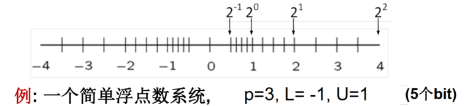

# <center>数值分析</center>

## 1.误差分析基础

### 1.1误差的来源

$$
误差来源
\begin{cases}
&计算前
\begin{cases}
&模型误差：例如，忽略了摩擦、空气阻力等\\
&数据误差：常数或测量值产生的误差
\end{cases}
\\
&计算中
\begin{cases}
&截断误差(例如，计算\sin(x)时取其泰勒展开的前几项)\\
&舍入误差：计算时表示的数的位数有限
\end{cases}
\\
\end{cases}
$$

### 1.2误差及其分类

1. **误差与有效数字**

   * **绝对误差**$e(\hat{x})=\hat{x}-x$
   * **相对误差**$e_r(\hat{x})=\frac{\hat{x}-x}{x}$
   * **误差绝对值上限**$\epsilon(\hat{x})$
   * **误差限**$\epsilon_r(\hat{x})=\frac{\epsilon(\hat{x})}{\hat{x}}$
   * **有效数字**：从左至右**第一个非零数字**开始的所有数字

   *Theorem 1.2*：设对$x$保留$p$位有效数字后得到的近似值$\hat{x}$，则$\hat{x}$的相对误差$|e_r(\hat{x})|\leq\frac{5}{d_0}\times 10^{-p}$，其中$d_0$为$x$的第一位有效数字。

   *Theorem 1.3*：设$x$的第一位有效数字为$d_0$，若近似值$\hat{x}$的相对误差满足$|e_r(\hat{x})|\leq \frac{5}{d_0+1}\times 10^{-p}$，则$\hat{x}$的**前$p$位有效数字**与$x$的相同，或**保留$p$位有效数字**后$\hat{x}$和$x$的结果相等。

   *Proof*：设$x=\pm 10^m\times(d_0+\frac{d_1}{10}+\cdots+\frac{d_{p-1}}{10^{p-1}}+\frac{d_p}{10^p}+\cdots)$

   有$|x|<10^m(d_0+1)$

   进而有$|e(\hat{x})|=|e_r(\hat{x})|\cdot|x|\leq10^m\times\frac{5}{10^p}$

   也即，$\hat{x}$与$x$的差的首位有效数字在$d_p$所在的数位上，且$\in(-5,5)$。若$x$与$\hat{x}$的第$p$位有效数字均为$d_{p-1}$，则原定理得证；否则，二者一定恰好相差1，从而保留$p$位有效数字后$\hat{x}$和$x$的结果相等。

   > *Theorem 1.2*和*Theorem 1.3*讨论的是**有效数字位数**与**相对误差限**的关系。

   > *Theorem 1.3*中的两种结论，可视为是**保留$p$位有效数字后正确**的两个含义。

   将*Theorem 1.3*特殊化，可以得到*Theorem 1.4*

   *Theorem 1.4*：若相对误差$\leq \frac{1}{2}\times 10^{-p}$，则**保留$p$位有效数字后近似值是正确的**。

2. **数据传递误差与计算误差**
   $$
   \text{误差}=\hat{f}(\hat{x})-f(x)=\underbrace{[\hat{f}(\hat{x})-f(\hat{x})]}_{计算误差}+\underbrace{[f(\hat{x})-f(x)]}_{数据传递误差}
   $$

   > 数据传递误差：输入的误差传递到结果而产生的误差
   
3. **截断误差与舍入误差**

   包括两部分，分别为**数值方法近似**以及**有限精度运算**。

   例：用差商计算一阶导数
   $$
   f'(x)\approx\frac{f(x+h)-f(x)}{h}
   $$
   截断误差$e_T=hf''(\xi)/2$，则$\epsilon_T=Mh/2$，其中$M$是$|f''(\xi)|$上界。

   设计算$f(x)$的误差限为$\epsilon$，则$\epsilon_R=2\epsilon/h$。

   从而$\epsilon_{tot}=\epsilon_T+\epsilon_R=\frac{Mh}{2}+\frac{2\epsilon}{h}$。

### 1.3问题的敏感性

**敏感性**：**输入数据==扰动==对问题解的影响程度**，分为**不敏感**（**良态**）和**敏感**（**病态**）。

* **条件数**
  $$
  \textit{cond}=\left|\frac{[f(\hat{x})-f(x)]/f(x)}{(\hat{x}-x)/x}\right|\approx\left|\frac{xf'(x)}{f(x)}\right|
  $$

* **绝对条件数**
  $$
  \textit{cond}_A=\left|\frac{f(\hat{x})-f(x)}{\hat{x}-x}\right|
  $$
  可通过多元Taylor展开取线性项的方式来估计数据传递误差限
  $$
  \epsilon(\hat{y})=|y-\hat{y}|\approx \sum_{i=1}^n\left|\frac{\partial f}{\partial x_i}(\hat{x}_1,\cdots,\hat{x}_n)\right|(x_i-\hat{x}_i)=\sum_{i=1}^n\left|\frac{\partial f}{\partial x_i}(\hat{x}_1,\cdots,\hat{x}_n)\right|\epsilon(\hat{x}_i)
  $$

注意：**一个问题的敏感性与使用的求解算法无关**。这是因为，求解算法影响的是$$\hat{f}(\hat{x})$$，而非$$f(\hat{x})$$，这与一个问题本身无关。

### 1.4算法的稳定性

考虑两个方面，**精度位数**对结果的影响，以及**误差放大**。

1. **结果对==计算过程中的扰动不敏感==的算法更稳定**。
2. 对包含一系列计算步的过程，若**中间步结果的相对误差不放大或放大不严重**，则该过程对应的算法**更稳定**。

如果一个算法包含很多步，从输入量开始“**向前**”做舍入误差分析很难，因此通常采用**向后误差分析**，也即，求$$\hat{x}$$满足$$f(\hat{x})=\hat{y}$$，则$$\Delta x=\hat{x}-x$$称为**向后误差**。**向后误差的大小反映了算法过程的稳定性**。

### 1.5计算机浮点数系统

#### 1.5.1浮点数的表示

$$
fl(x)=\pm(d_0+\frac{d_1}{2}+\frac{d_2}{2^2}+\cdots+\frac{d_{p-1}}{2^{p-1}})\times 2^E
$$

其中，$$\beta=2$$称为**基数**，$$E$$称为**指数**，其具有**上限值**$$U$$和**下限值**$$L$$，$$p$$称为**精度位数**。**规范化**的规则要求$$d_0=1$$。这样表示出来的浮点数为有限个，且**非均匀**地分布在实数轴上。



如上图所示，每两个2的幂次之间均恰好有4个浮点数值（$$2^{p-1}$$，第1位尾数始终为1）。其中，$$\epsilon_{mach}=2^{-p}$$称为**机器精度**，其也可以理解为**1与右边相邻的浮点数间隔的一半**。**下溢值**$$=2^L$$，**上溢值**$$=(2-2^{-(p-1)})\times 2^U$$。

==*Theorem 1.5*：**设实数$$x$$在浮点数系统中的表示为浮点数$$fl(x)$$，则有$$\left|\frac{fl(x)-x}{x}\right|\leq\epsilon_{mach}$$**。==

将*Theorem 1.2*拓展到二进制即得。由此定理也可以进一步理解**机器精度**的定义。

*Theorem 1.6*：**$$x_1,x_2\in\mathcal{R}$$，若$$\left|\frac{x_2}{x_1}\right|\leq\frac{1}{2}\epsilon_{mach}$$，则$$x_2$$的值对浮点运算$$x_1+x_2$$的结果毫无影响**。

不妨设$$x_1=(d_0+\frac{d_1}{2}+\frac{d_2}{2^2}+\cdots+\frac{d_{p-1}}{2^{p-1}})\times 2^E$$，则$$|x_1|<2\times2^E$$，进而有$$|x_2|<\epsilon_{mach}\times 2^E$$。而$$d_0+\frac{d_1}{2}+\frac{d_2}{2^2}+\cdots+\frac{d_{p-1}}{2^{p-1}}$$是一个位于$$(1,2)$$之间的数，因此其加上一个小于$$\epsilon_{mach}$$的数并不会造成其值的改变。

*Theorem 1.6*也被称为“**大数吃掉小数**”的现象。用类似的方法，可以得到如果$$\left|\frac{x_2}{x_1}\right|>\epsilon_{mach}$$，则一定“**不吃小数**”。

#### 1.5.2抵消现象

两个**符号相同**、**值相近**的$$p$$位数相减使结果的有效数字**远少于$$p$$位**，称为**抵消**。

结果的有效数字位数的减少，意味着**相对误差的放大**，其往往会影响后续计算的准确度。因此，**抵消现象是发生信息丢失、误差变大的信号**。

> 减小舍入误差的建议：
>
> 1. 提高精度，采用双精度浮点数
> 2. 避免中间结果出现上溢、下溢
> 3. 避免“大数吃掉小数”
> 4. 避免符号相同的两相近数相减
> 5. 简化步骤，减少运算次数


## 2.非线性方程求根

### 2.1引言

非线性方程求根：求非线性方程$$f(x)=0$$在区间$$[a,b]$$上的实数解。

对于该问题的敏感性，求出绝对条件数$$\left|\frac{\Delta x}{\Delta y}\right|\approx\left|\frac{1}{f'(x^{*})}\right|$$，其中$$x^{*}$$对应$$f(x)=0$$的解。由此可知，$$|f'(x^{*})|$$越小，该问题越敏感。特别地，对于多重根，$$f'(x^{*})=0$$，此时问题很敏感。

### 2.2二分法

*Theorem 2.1*：**若$$f(x)\in C[a,b]$$，且$$f(a)f(b)<0$$，则区间$$(a,b)$$内至少有一个实根。**

通过逐次将**有根区间一分为二**，可以得到区间序列$$\{(a_k,b_k)\}$$，近似解$$x_k=\frac{a_k+b_k}{2}$$，且有误差$$|x_k-x^{*}|<(b_k-a_k)/2=(b_0-a_0)/2^{k+1}$$。由此，**可以估计要达到某个误差限时需要的二分次数**。

> 需要注意的是，浮点运算下，二分法的结果准确度有一个极限（也即当区间的两个端点为**相邻的两个浮点数**，计算其中点时不会再得到新的区间），最小的有根区间的长度为$$2^E\cdot2\cdot\epsilon_{mach}$$，其中$$E$$为准确解$$x^{*}$$的浮点数指数。

二分法运算简单，算法比较稳定，总能收敛，但是其收敛速度较慢，且无法处理**没有有根区间**的情况。

### 2.3不动点迭代法

首先将$$f(x)=0$$转化为$$x=g(x)$$，从而转而求$$g(x)$$的不动点，其可以通过迭代法：
$$
\begin{cases}
&给定x_0\\
&x_{k+1}=g(x_k)
\end{cases}
$$
若序列$$\{x_k\}$$收敛到$$x^{*}$$，则$$x^{*}$$就是原方程的解。

*Theorem 2.3*（**全局收敛的充分条件**）：$$g(x)\in C[a,b]$$，若

1. $$\forall x\in[a,b]$$，有$$a\leq g(x)\leq b$$
2. $$\exist L\in(0,1),\forall x_1,x_2\in[a,b]$$，有$$|g(x_1)-g(x_2)|\leq L|x_1-x_2|$$

则$$g(x)$$在$$[a,b]$$上存在不动点，且唯一。

实际上，根据条件1，考察区间端点处的取值即可保证$$g(x)$$存在不动点。对于唯一性，假设存在两个不动点$$x_1^{*}<x_2^{*}$$，有$$\frac{g(x_1^{*})-g(x_2^{*})}{x_1^{*}-x_2^{*}}=1$$。这即与条件2矛盾。

*Theorem 2.4*：若$$g(x)$$满足*Theorem 2.3*中的两个条件，则$$\forall x_0\in[a,b]$$，不动点迭代法$$x_{k+1}=g(x_k)$$都收敛到不动点$$x^{*}$$，且满足$$|x_k-x^{*}|\leq\frac{L_k}{1-L}|x_1-x_0|$$。

考察误差序列$$|x_k-x^{*}|=|g(x_{k-1})-g(x^{*})|\leq L|x_{k-1}-x^{*}|\leq\cdots\leq L^k|x_0-x^{*}|$$，从而有$$\lim_{k\rightarrow\infty}|x_k-x^{*}|=\lim_{k\rightarrow\infty}L^k|x_0-x^{*}|=0$$，也即$$\lim_{k\rightarrow\infty}x_k=x^{*}$$。

> 注：说明全局收敛时，条件2常替换为==$$\forall x\in[a,b],|g'(x)|<1$$，且$$g(x)\in C^1[a,b]$$==。
>
> 这是因为，首先闭区间上的有界连续函数存在最值$$|g'_{max}|<1$$，又根据中值定理，有
> $$
> |g(x_1)-g(x_2)|=|g'(\xi)(x_1-x_2)|\leq |g'_{max}||x_1-x_2|=L|x_1-x_2|
> $$

*Theorem 2.6*（**局部收敛的充分条件**）：设$$x^{*}$$是$$g(x)$$的不动点，若$$|g'(x^{*})|<1$$，且$$g'(x)$$在$$x^{*}$$的某领域上连续，则迭代法$$x_{k+1}=g(x_k)$$局部收敛。

存在$$x^{*}$$的某个领域$$D,s.t.\forall x\in D,|g'(x)|\leq L< 1$$，从而由*Theorem 2.4*可知算法在$$D$$上全局收敛，进而在原定义域上局部收敛。

> 反过来，若$$|g'(x^{*})|>1$$，则解在靠近$$x^{*}$$时，误差有放大的趋势。

**稳定性与收敛阶**

假设**迭代解序列**$$\{x_0,x_1,\cdots,x_k,\cdots\}$$收敛。若误差$$e(k)=x_k-x^{*}$$满足$$\lim_{k\rightarrow\infty}\frac{|e(x_{k+1})|}{|e(x_k)|^p}=c,\space(c\neq0)$$，则称$$p$$阶收敛，或收敛阶为$$p$$。

显然，由于$$c\neq 0$$，因此对于任意一个收敛的迭代法，数值$$p$$是唯一的。$$p=1$$时称为线性阶收敛，$$p>1$$时称为超线性收敛。

*Theorem 2.7*：迭代法$$x_{k+1}=g(x_k)$$，若$$g^{(p)}(x)$$在不动点$$x^{*}$$附近**连续**，整数$$p\geq2$$，则该方法在$$x^{*}$$的邻域上$$p$$阶收敛**当且仅当**以下条件成立：
$$
g'(x^{*})=g''(x^{*})=\cdots=g^{(p-1)}(x^{*})=0,\space g^{(p)}(x^{*})\neq 0
$$

> 推论：$$g'(x)=0\Leftrightarrow$$ 至少2阶局部收敛。

*Proof.* 先证明充分性，$$e(x_{k+1})=g(x_k)-g(x^{*})$$，在$$x^{*}$$处做Taylor展开，有：
$$
\begin{align}
e(x_{k+1})=&g(x_k)-g(x^{*})\\
=&g'(x^{*})(x_k-x^{*})+\frac{g''(x^{*})}{2}(x_k-x^{*})^2+\cdots\\
&+\frac{g^{(p-1)}(x^{*})}{(p-1)!}(x_k-x^{*})^{p-1}+\frac{g^{(p)}(\xi_k)}{p!}(x_k-x^{*})^p\\
=&\frac{g^{(p)}(\xi_k)}{p!}(x_k-x^{*})^p
\end{align}
$$
因此，
$$
\lim_{k\rightarrow\infty}\frac{|e(x_{k+1})|}{|e(x_k)|^p}=\lim_{k\rightarrow\infty}\frac{|g^{(p)}(\xi_k)|}{p!}=\frac{g^{p}(x^{*})}{p!}\neq 0
$$
从而该方法$$p$$阶收敛，充分性得证。

对于必要性，假设$$x^{*}$$处直到$$g(x)$$的$$q$$（$$q\neq p$$）阶导数才不为0，如上论述得到该方法$$q$$阶收敛，而这与收敛阶的唯一性矛盾，从而必要性得证。

### 2.4牛顿法

> 优点：
>
> 1. **减少不动点迭代法构造的盲目性**
> 2. **较好的收敛性**（收敛阶）

其原理为**用切线近似曲线**，令切线方程$$P(x)=f(x_k)+(x-x_k)f'(x)=0$$，得到：
$$
x_{k+1}=x_k-\frac{f(x_k)}{f'(x_k)},\quad f'(x)\neq 0
$$
其本质上也为不动点迭代法，对应$$g(x)=x-\frac{f(x)}{f'(x)}$$。特别地，$$g'(x)=\frac{f(x)f''(x)}{[f'(x)]^2}$$，因此对于**单根**$$x^{*}$$，有$$g'(x^{*})=0$$，从而该方法至少**2阶收敛**（一般也就是2阶收敛）。由此可得如下定理：

*Theorem 2.9*：设$$x^{*}$$是方程$$f(x)=0$$的单根，且$$f(x)$$在$$x^{*}$$附近有连续的二阶导数，则**牛顿法至少==局部二阶收敛==**。

牛顿法一般局部收敛，对于初值比较敏感，且对$$f(x)$$的连续性要求高。

### 2.5迭代法的判停准则

* **残差判据**：$$|f(x_k)|\leq\epsilon_1$$。注意残差小不意味着$$x_k-x^{*}$$也小
* **误差判据**：$$|x_k-x_{k-1}|\leq\epsilon_2$$。同样，这也不意味着$$x_k-x^{*}$$很小
* **相对误差判据**：$$|x_k-x_{k-1}|\leq\epsilon_3|x_k|$$

### 2.6割线法

为了避免牛顿法中（可能无法进行的）**导数计算**，使用**割线**进行近似。
$$
P(x)=f(x_k)+\frac{f(x_k)-f(x_{k-1})}{x_k-x_{k-1}}(x-x_k)
$$
得到
$$
x_{k+1}=x_k-\frac{f(x_k)}{f(x_k)-f(x_{k-1})}(x_k-x_{k-1})
$$
*Theorem 2.10*（**割线法的收敛阶**）：若$$f(x)$$在根$$x^{*}$$某领域内二阶连续可导且$$f'(x)\neq 0$$，则当$$x_0,x_1$$充分接近$$x^{*}$$时，割线法按$$p\approx1.618$$阶收敛（超线性）。

### 2.7抛物线法

$$
x_k,x_{k-1},x_{k-2}\xrightarrow{二次多项式近似f(x)}x_{k+1}
$$

特别地，这里的二次多项式中**将$$x$$看成$$y$$的二次函数**，这样其与$$x$$轴能有一个交点，也即$$x_{k+1}$$。此方法也称为**逆二次插值法**，局部收敛阶$$p\approx1.839$$。

### 2.8实用求根技术

* **牛顿下山法**

  为防止牛顿迭代法过程发散，采用一种**阻尼牛顿法**，加入一系列**比例因子**$$\lambda_i\in(0,1]$$：
  $$
  x_{k+1}=x_k-\lambda_i\frac{f(x_k)}{f'(x_k)}
  $$
  其中，$$\lambda_i$$的值应当从1开始递减。其具体的取值实际上要**根据经验**。

  牛顿下山法伪代码如下：

  ```
  while 不满足收敛判据 do
  	s = f(x_k) / f'(x_k)
  	x_{k+1} = x_k - s
  	i := 0
  	while |f(x_{k+1})|>|f(x_k)| do
  		x_{k+1} = x_k - \lambda_i * s
  		i := i + 1
  ```

  即：不断减小阻尼系数$$\lambda_i$$的值，直到$$|f(x_{k+1})|<|f(x_k)|$$，防止发散。

* **通用求根算法zeroin**

  将**二分法**与**割线法/抛物线法**结合，得到稳定快速的求根方法。

  步骤：

  1. 输入有根区间$$[a,b]$$

  2. 用$$b$$表示最优解，与$$a$$构成有根区间，而$$c$$为次优解（上一步得到的解）

  3. 迭代，每步中不断调整$$a,b,c$$，直到$$|f(b)|$$足够小，或$$|a-b|$$足够小

     * 调整$$a,b,c$$：

       1. 若$$f(a)$$的正负号与$$f(b)$$相同，则将$$c$$的值赋给$$a$$
       2. 若$$|f(a)|<|f(b)|$$，则对调$$a$$和$$b$$的值，然后将$$a$$的值赋给$$c$$

       也即：**始终保证$$b$$是最优解，$$c$$是次优解，$$[a,b]$$为有根区间**。

     * **执行何种算法**

       1. 若$$c\neq a$$，则利用$$a,b,c$$以及它们的函数值做**逆二次插值法**的一步迭代，否则执行**割线法**

       2. 若逆二次插值法/割线法得到的近似解足够满意（也即，相邻解之差的缩小程度足够大，在有根区间之内），则用它更新$$b$$，否则执行一步**二分法**来更新$$b$$的值；再将改变之前$$b$$的值赋给$$c$$。

          > 这样，按照逆二次插值、割线法、二分法的优先顺序生成下一步解，可以保证较快的收敛速度。

### 2.9非线性方程组求解

$$
\mathbf{f}(\mathbf{x})=\mathbf{0}\Longleftrightarrow\mathbf{x}=\mathbf{g}(\mathbf{x})
$$

定义多元向量函数$$\mathbf{g}:\mathbb{R}^n\rightarrow\mathbb{R}^n$$的**雅可比矩阵**$$\mathbf{J_g}(\mathbf{x})$$为$$n$$阶方阵，元素值为$$\{\mathbf{J_g}(\mathbf{x})\}_{ij}=\frac{\partial \mathbf{g}_i(x)}{\partial x_j}$$。

*Theorem 2.10*：不动点迭代法$$\mathbf{x}_{k+1}=\mathbf{g}(\mathbf{x}_k)$$，设$$\mathbf{x}^{*}$$为准确解，若雅可比矩阵$$\mathbf{J_g}(\mathbf{x}^{*})$$的特征值$$\lambda$$满足$$|\lambda|<1$$，则该迭代法**局部收敛**。

**牛顿迭代法**：
$$
x_{k+1}=x_k-\frac{f(x_k)}{f'(x_k)}\Longrightarrow\mathbf{x}_{k+1}=\mathbf{x}_k-[\mathbf{J_f}(\mathbf{x}_k)]^{-1}\mathbf{f}(\mathbf{x}_k)
$$


## 3.线性方程组的直接解法

线性方程组的解法分为**直接解法**与**迭代解法**。

### 3.1基本概念

* **向量的范数**：记为$$||\cdot||$$

  向量的范数具有**正定性**、**正齐次性**、**三角不等式**。

  对于数域$$\mathbb{K}$$上的线性空间$$S$$，若定义了范数，则称为**赋范线性空间**。

  **$$p-$$范数**：$$\mathbf{x}=[x_1,x_2,\cdots,x_n]^T,\space||\mathbf{x}||_p=(\sum_{i=1}^n|x_i|^p)^{\frac{1}{p}},\space p>1$$。

  **内积范数**：针对**内积**$$\left<x,y\right>$$，定义范数$$||\mathbf{x}||=\sqrt{\left<\mathbf{x},\mathbf{x}\right>}$$。

  三种常用范数：

  1. **1-范数**：$$||\mathbf{x}||_1=\sum_{i=1}^n|x_i|$$，也被称为**曼哈顿范数**
  2. **2-范数**：$$||\mathbf{x}||_2=\sqrt{\sum_{i=1}^n|x_i|^2}$$，也被称为**欧式范数/内积范数**
  3. **$$\infty-$$范数**：$$||\mathbf{x}||_{\infty}=\max_{1\leq i\leq n}|x_i|$$，也被称为**“最大”范数**

  *Theorem 3.6*：存在$$f\in C^1$$，使得$$||\mathbf{x}||=f(x_1,x_2,\cdots,x_n)$$。

  *Theorem 3.7*（**不同范数的等价性**）：$$c_1||\mathbf{x}||_s\leq||\mathbf{x}||_t\leq c_2||\mathbf{x}||_s$$，其中$$c_1,c_2>0$$为与$$\mathbf{x}$$无关的常数。

  根据*Theorem 3.7*，**在某种范数下成立的一些结论在其他范数下也成立**。

  *Theorem 3.8*：$$\lim_{k\rightarrow\infty}\mathbf{x}^{(k)}=\mathbf{x}^{*}\Leftrightarrow\lim_{k\rightarrow\infty}||\mathbf{x}^{(k)}-\mathbf{x}^{*}||$$

  > 根据*Theorem 3.7*，为证明*Theorem 3.8*，只需说明其对于$$\infty-$$范数成立即可。而这是显然的。

* **矩阵的范数**

  对$$\mathbb{R}^{n\times n}$$空间的**矩阵范数**，需要增加一些条件：

  1. 增加对矩阵乘法的要求：$$||\mathbf{AB}||\leq||\mathbf{A}||\cdot||\mathbf{B}||$$
  2. **相容性条件**：$$||\mathbf{Ax}||\leq||\mathbf{A}||\cdot||\mathbf{x}||$$

  根据某种向量范数$$||\mathbf{x}||_v$$，定义矩阵的**算子范数**（也称为**向量诱导范数**）：
  $$
  ||\mathbf{A}||_v=\max_{\mathbf{x}\neq \mathbf{0}}\frac{||\mathbf{Ax}||_v}{||\mathbf{x}||_v},\quad x\in\mathbb{R}^n,A\in\mathbb{R}^{n\times n}
  $$
  直观理解，也即$$\mathbf{Ax}$$对向量$$\mathbf{x}$$的最大拉伸倍数（也可能$$<1$$）。对于$$||\mathbf{x}||_v=1$$，$$\mathbf{x}$$的端点轨迹为二维空间中的单位圆，而$$\mathbf{Ax}$$向量端点的轨迹为**椭圆**，$$||\mathbf{A}||_v$$就是这个椭圆**半长轴**的长度。矩阵范数的相容性条件显然成立，对矩阵乘法要求的证明如下：
  $$
  \begin{align}
  ||\mathbf{AB}||_v=&\max_{\mathbf{x}\neq\mathbf{0}}\frac{||\mathbf{ABx}||_v}{||\mathbf{x}||_v}
  =\max_{\mathbf{x}\neq\mathbf{0}}(\frac{||\mathbf{ABx}||_v}{||\mathbf{Bx}||_v}\cdot\frac{||\mathbf{Bx}||_v}{||\mathbf{x}||_v})\\
  \leq&\max_{\mathbf{x}\neq\mathbf{0}}\frac{||\mathbf{A(Bx)}||_v}{||\mathbf{Bx}||_v}\cdot\max_{\mathbf{x}\neq0}\frac{||\mathbf{Bx}||_v}{||\mathbf{x}||_v}\\
  \leq&\max_{\mathbf{x}\neq\mathbf{0}}\frac{||\mathbf{Ax}||_v}{||\mathbf{x}||_v}\cdot\max_{\mathbf{x}\neq0}\frac{||\mathbf{Bx}||_v}{||\mathbf{x}||_v}\\
  =&||\mathbf{A}||\cdot||\mathbf{B}||
  \end{align}
  $$
  **常用的矩阵范数**：

  1. **1-范数**：$$||\mathbf{A}||_1=\max_{1\leq j\leq n}\sum_{i=1}^n|a_{ij}|$$（竖列元素绝对值之和的最大值）
  2. **$$\infty$$-范数**：$$||\mathbf{A}||_{\infty}=\max_{1\leq i\leq n}\sum_{j=1}^n|a_{ij}|$$
  3. **2-范数**：$$||\mathbf{A}||_2=\sqrt{\lambda_{\max}(\mathbf{A}^T\mathbf{A})}$$，其中，$$\lambda_{\max}$$表示取矩阵的**最大特征值**。
  4. **Frobenius范数**：$$||\mathbf{A}||_F=\sqrt{\sum_{i=1}^n\sum_{j=1}^na_{ij}^2}=\sqrt{tr(\mathbf{A}^T\mathbf{A})}$$

### 3.2问题的敏感性

$$
\mathbf{Ax=b}\Longrightarrow\mathbf{A(x+}\Delta\mathbf{x})=\mathbf{b}+\Delta\mathbf{b}
$$

条件数$$\texttt{cond}=\frac{||\Delta\mathbf{x}||/||\mathbf{x}||}{||\Delta\mathbf{b}||/||\mathbf{b}||}\leq||\mathbf{A}||\cdot||\mathbf{A}^{-1}||$$

> 这是因为，$$\Delta \mathbf{x}=\mathbf{A}^{-1}\Delta \mathbf{b}$$，从而有$$||\Delta\mathbf{x}||\leq||\mathbf{A}^{-1}||\cdot||\Delta\mathbf{b}||$$，同理有$$||\mathbf{b}||\leq||\mathbf{A}||\cdot||\mathbf{x}||$$。

上式也被称为矩阵的条件数。设$$\mathbf{A}$$为**非奇异矩阵**，则定义矩阵$$\mathbf{A}$$的条件数$$\texttt{cond}(\mathbf{A})=||\mathbf{A}||\cdot||\mathbf{A}^{-1}||$$。

矩阵的条件数是**反映线性方程组求解问题的敏感性的条件数的上界**。如果矩阵条件数大，则问题很**病态**，此时称该矩阵为**病态矩阵**；反之则称问题为**良态**。

*Theorem 3.11*：在任一算子范数下，有：
$$
\texttt{cond}(\mathbf{A})=\max_{\mathbf{x}\neq\mathbf{0}}\frac{||\mathbf{Ax}||}{||\mathbf{x}||}/\min_{\mathbf{x}\neq\mathbf{0}}\frac{||\mathbf{Ax}||}{||\mathbf{x}||}
$$
这是因为，$$||\mathbf{A}^{-1}||=\max_{\mathbf{x}\neq\mathbf{0}}\frac{||\mathbf{A^{-1}x}||}{||\mathbf{x}||}=\max_{\mathbf{x}\neq\mathbf{0}}\frac{||\mathbf{x}||}{||\mathbf{Ax}||}=\frac{1}{\min_{\mathbf{x}\neq\mathbf{0}}\frac{||\mathbf{Ax}||}{||\mathbf{x}||}}$$。这体现出$$\texttt{cond}(\mathbf{A})$$的几何意义，也即**对单位圆的扭曲程度**，同时也说明$$\texttt{cond}(\mathbf{A})\geq 1$$。此外，定义$$\texttt{cond}(奇异矩阵)=+\infty$$。

*Theorem 3.12*：矩阵条件数具有如下性质：

1. $$\texttt{cond}(\mathbf{A})\geq 1$$，$$\texttt{cond}(\mathbf{A}^{-1})=\texttt{cond}(\mathbf{A})$$，

   $$\texttt{cond}(c\mathbf{A})=\texttt{cond}(\mathbf{A}),\space\forall c\neq 0$$

2. $$\texttt{cond}(\mathbf{I})=1$$

3. $$\mathbf{D}$$为对角阵，则在$$p$$-范数意义下，$$\texttt{cond}(\mathbf{D})=\frac{\max_i|d_{ii}|}{\min_i|d_{ii}|}$$。

4. 采用2-范数，$$\texttt{cond}(\mathbf{A})=\sqrt{\frac{\lambda_{\max}(\mathbf{A^T}A)}{\lambda_{\min}(\mathbf{A^T}A)}}$$

5. $$\mathbf{Q}$$为正交矩阵，则有

   $$\texttt{cond}(\mathbf{Q})_2=1$$

   $$\texttt{cond}(\mathbf{QA})_2=\texttt{cond}(\mathbf{AQ})_2=\texttt{cond}(\mathbf{A})_2$$

   > 对于正交阵$$\mathbf{Q}$$，有$$||\mathbf{Qa}||_2=||\mathbf{a}||_2$$
   >
   > $$\texttt{cond}(\mathbf{QA})_2=\max_{\mathbf{x}\neq\mathbf{0}}\frac{||\mathbf{QAx}||}{||x||}=\max_{\mathbf{x}\neq\mathbf{0}}\frac{||\mathbf{Ax}||}{||\mathbf{x}||}=\texttt{cond}(\mathbf{A})_2$$

### 3.3矩阵的LU分解

**高斯消去法**：用初等变换将$$\mathbf{A}$$变为单位阵，用于算**逆矩阵**。

*Theorem 3.14*：对方程$$\mathbf{Ax=b}$$，其中$$\mathbf{A}\in\mathbb{R}^{n\times n}$$，若执行高斯消去过程中的主元$$a_{kk}^{(k)}\neq 0,(k=1,2,\cdots,n-1)\Longleftrightarrow$$系数矩阵$$\mathbf{A}$$**存在唯一**的**LU分解**。

**唯一性的证明**：假设$$\mathbf{A}=\mathbf{L_1U_1}=\mathbf{L_2U_2}$$，其中$$\mathbf{L_1},\mathbf{L_2}$$为单位下三角阵（非奇异）。若$$\mathbf{A}$$非奇异，则$$\mathbf{U_1}$$也非奇异，从而有$$\mathbf{L_1L_2^{-1}}=\mathbf{U_2U_1^{-1}}=I\Longrightarrow \mathbf{L_1}=\mathbf{L_2},\mathbf{U_1}=\mathbf{U_2}$$，矛盾。若$$\mathbf{A}$$奇异，则$$\mathbf{U}(n,n)=0$$，从而有
$$
\begin{bmatrix}
\mathbf{L_1^{'}} & \mathbf{0}\\
\mathbf{\alpha}_1^T & 1
\end{bmatrix}
\begin{bmatrix}
\mathbf{U_1^{'}} & \mathbf{\beta}_1\\
\mathbf{0}^T & 0
\end{bmatrix}
=
\begin{bmatrix}
\mathbf{L_2^{'}} & \mathbf{0}\\
\mathbf{\alpha}_2^T & 1
\end{bmatrix}
\begin{bmatrix}
\mathbf{U_2^{'}} & \mathbf{\beta}_2\\
\mathbf{0}^T & 0
\end{bmatrix}
$$
进而有$$\mathbf{L_1^{'}U_1^{'}}=\mathbf{L_2^{'}U_2^{'}}\Longrightarrow \mathbf{L_1^{'}}=\mathbf{L_2^{'}},\mathbf{U_1^{'}=\mathbf{U_2}^{'}}\Longrightarrow\mathbf{L_1=L_2},\mathbf{U_1=U_2}$$，矛盾。

**LU分解的用途**：

* **单个方程求解**：

  $$\mathbf{Ax=b}\Rightarrow\mathbf{x}=(\mathbf{LU})^{-1}\mathbf{b}=\mathbf{U^{-1}L^{-1}}b$$。

  1. 首先求解**单位下三角型方程组**$$\mathbf{Ly=b}$$
  2. 再求解**上三角型方程组**$$\mathbf{Ux=y}$$

* **右端项变化的问题**：

  $$\mathbf{Ax_i=b_i}$$，只需对每个右端项执行上述两步，而不需要重复计算LU分解。

### 3.4选主元技术与稳定性

*Theorem 3.15*：对矩阵$$\mathbf{A}\in\mathbb{R}^{n\times n}$$，高斯消去过程中**不出现零主元**的**充要条件**是，$$\mathbf{A}$$的前$$n-1$$个顺序主子式均不为零，即$$\det(A_k)\neq0,(k=1,2,\cdots,n-1)$$。

> 需要注意的是，如果高斯消去过程中**不出现零主元**，则**LU分解存在且唯一**，但反过来，LU分解存在不能说明**高斯消去过程一定没有零主元**。例如，矩阵$$\begin{bmatrix}0 & 0\\0 & 1\end{bmatrix}$$就有无穷多个LU分解，但是高斯消去过程存在零主元。不过，**LU分解存在且唯一**与**高斯消去过程中不出现零主元**等价。
>
> 并且，LU分解的存在性与唯一性与$$\mathbf{A}$$是否奇异无关。**对奇异矩阵$$\mathbf{A}$$也可能完成消去、LU分解**，例如$$\mathbf{A}=\begin{bmatrix}1 & 1\\1 & 1\end{bmatrix}$$（关键在于LU分解不要求最后一个主元非零），而**非奇异矩阵也不一定有LU分解**（可能需要先进行一些初等行变换）。

通过**选主元技术**，可以解决主元为零的问题，同时，通过将同一列中的最大元素换做主元，还可以**减小数值误差**，从而增强算法稳定性。

**部分主元的LU分解**：
$$
\mathbf{PA}=\mathbf{LU}
$$
其中，$$\mathbf{P=P_{n-1}P_{n-2}\cdots P_1}$$称为**排列阵**，其为单位阵$$\mathbf{I}$$重排的结果。

> 数值更稳定的**全选主元**：选取未消去子矩阵中的最大元素，通过**行**、**列**交换到主元位置。
> $$
> \mathbf{PAQ}=\mathbf{LU}
> $$

**算法的稳定性**：

高斯消去法主要受**舍入误差**的影响。通过**向后误差分析**，我们可以得到其误差的一个上界。设方程$$\mathbf{Ax}=b$$的数值解为$$\mathbf{\hat{x}}$$，且$$(\mathbf{A}+\Delta\mathbf{A})\mathbf{\hat{x}}=\mathbf{b}$$，有
$$
\frac{||\Delta\mathbf{A}||_{\infty}}{||\mathbf{A}||_{\infty}}\lesssim n\rho\epsilon_{mach}
$$
其中，$$\rho$$为增长因子，表示$$\mathbf{A}^{(k)}$$（第$$k$$步高斯消去法后得到的矩阵）与$$\mathbf{A}$$最大元素之比。对于部分选主元方法，有$$\rho\leq2^{n-1}$$，但实际往往远小于这个上界；对于不选主元的方法，$$\rho$$可能任意大。

### 3.5对称正定矩阵的*Cholesky*分解

> 正定矩阵：**所有顺序主子式的行列式均为正**；半正定矩阵：**所有顺序主子式的行列式均非负**

对于对称矩阵$$\mathbf{A}$$，有
$$
\mathbf{A}=\mathbf{LDU_0}=\mathbf{A}^T=\mathbf{U_0^T DL^T}
$$
从而若高斯消去不中断，LU分解唯一，有$$\mathbf{L}=\mathbf{U_0^T}$$。

对于**对称正定矩阵**$$\mathbf{A}$$，其LU分解一定存在且唯一，故$$\mathbf{A=LDL^T}$$唯一存在，且$$\mathbf{D}=\mathbf{L^{-1}AL^T}$$也为对称正定矩阵，其对角元均大于零。故有：
$$
\mathbf{A}=\mathbf{LD^{\frac{1}{2}}D^{\frac{1}{2}}L^T}=\mathbf{L_1}\mathbf{L_1^T}
$$
此称为***Cholesky*分解**，由于其分解为一组对称阵的乘积，存储量可以节省一半。

***Cholesky*分解算法（平方根法）**

与直接LU分解的思想类似。
$$
\begin{bmatrix}
l_{11}&0&\cdots&0\\
l_{21}&l_{22}&\ddots&\vdots\\
\vdots&\vdots&\ddots&0\\
l_{n1}&l_{n2}&\cdots&l_{nn}
\end{bmatrix}
\begin{bmatrix}
l_{11}&l_{21}&\cdots&l_{n1}\\
0&l_{22}&\cdots&l_{n2}\\
\vdots&\ddots&\ddots&\vdots\\
0&\cdots&0&l_{nn}
\end{bmatrix}
=
\begin{bmatrix}
a_{11}&a_{12}&\cdots&a_{1n}\\
a_{21}&a_{22}&\cdots&a_{2n}\\
\vdots&\vdots&\ddots&\vdots\\
a_{n1}&a_{n2}&\cdots&a_{nn}
\end{bmatrix}
$$
考虑对应位置元素相等，有（**原地存$$\mathbf{L}$$的结果**）
$$
a_{jj}=\sqrt{a_{jj}-\sum_{k=1}^{j-1}a_{jk}^2}\quad j=1,2,\cdots,n
$$

$$
a_{ij}=(a_{ij}-\sum_{k=1}^{j-1}a_{ik}a_{jk})/a_{jj}\quad i=j+1,\cdots,n
$$

**算法的稳定性**：

考虑**增长因子**
$$
\rho=\frac{\max\{|U^T(i,j)|\}}{\max\{|a_{ij}|\}}=\frac{\max\{|l_{ij}l_{jj}|\}}{\max\{|a_{ij}|\}}\leq\frac{\max\{l_{ij}^2\}}{\max\{a_{ii}\}}\leq1
$$
注：由上平方根算法，可知**$$\mathbf{A}$$的对角元是$$\mathbf{L}$$一行元素的平方和**。

### 3.6带状矩阵解法与稀疏矩阵简介

#### 3.6.1带状矩阵

矩阵$$\mathbf{A}=(a_{ij})_{n\times n}$$，若$$\forall i,j,\space|i-j|>\beta$$时都有$$a_{ij}=0$$，且$$\exist k,a_{k,k-\beta}\neq 0$$或$$a_{k,k+\beta}\neq 0$$，则称$$\mathbf{A}$$为**半带宽**为$$\beta$$的**带状矩阵**。对于带状矩阵，其LU分解中，$$\mathbf{L}$$、$$\mathbf{U}$$矩阵的**非零元**依然分布在**原始带宽范围内**。

> 注意，对于带状矩阵的LU分解，其$$\mathbf{A^{-1},L^{-1},U^{-1}}$$均稠密，因此应避免再计算逆矩阵。

**按行对角占优矩阵**：$$|a_{ii}|\geq\sum_{j=1,j\neq i}^n|a_{ij}|,\space i=1,2,\cdots,n$$，且至少有一个大于号成立。（若均为严格大于，则称为**严格对角占优矩阵**）。

*Theorem 3.20*：**按列严格对角占优阵**，列主元LU分解不需要交换行。

#### 3.6.2稀疏矩阵

* **三元组**（COO）：值、行下表、列下标

* **压缩稀疏行**（CSR）：值、（按行顺序存储的）列下标的列表、每行开头在列表中的位置

  CSR是为了解决COO中连续存储的元素有相同的行编号的问题

* **压缩稀疏列**（CSC）

* **若干个一维数组**：针对带状矩阵，每个数组存储一条带

* **分块压缩稀疏行**：针对分块矩阵

在进行稀疏矩阵有关的计算时，不存储零元素，**只需遍历所有非零元**。而对稀疏矩阵做高斯消去时，填入的元素可能会造成稀疏矩阵存储结构的变化。


## 4.线性方程组的迭代解法

对于大规模**稀疏矩阵**，直接解法中的**填入**操作导致了巨大的计算时间、空间开销。因此在追求计算速度、允许一定准确度损失时可以采用**迭代解法**（**一阶定常迭代法**）。
$$
\mathbf{Ax}=\mathbf{b}\xrightarrow{\mathbf{A}=\mathbf{M}-\mathbf{N}}\mathbf{Mx}-\mathbf{Nx}=\mathbf{b}\Longrightarrow\mathbf{x}=\mathbf{M}^{-1}\mathbf{Nx}+\mathbf{M}^{-1}\mathbf{b}
$$

$$
\mathbf{x}^{(k+1)}=\mathbf{Bx}^{(k)}+\mathbf{f}
$$

### 4.1雅可比迭代法

分量依次迭代，令$$\mathbf{A=D-(D-A)}$$，其中$$\mathbf{D}$$为对角阵（对角元素即为$$\mathbf{A}$$的对角元素）。
$$
\begin{cases}
&x_1^{(k+1)}=&-\frac{1}{a_{11}}(&\quad&a_{12}x_2^{(k)}&+a_{13}x_3^{(k)}&)+\frac{b_1}{a_{11}}\\
&x_2^{(k+1)}=&-\frac{1}{a_{22}}(&a_{21}x_1^{(k)}+&\quad&+a_{23}x_3^{(k)}&)+\frac{b_2}{a_{22}}\\
&x_3^{(k+1)}=&-\frac{1}{a_{33}}(&a_{31}x_1^{(k)}+&a_{32}x_2^{(k)}&\quad&)+\frac{b_3}{a_{33}}
\end{cases}
$$
有：
$$
\mathbf{x}^{(k+1)}=\mathbf{D}^{-1}(\mathbf{D}-\mathbf{A})\mathbf{x}^{(k)}+\mathbf{D}^{-1}\mathbf{b}
$$
其中
$$
\mathbf{D}=
\begin{bmatrix}
a_{11}&&\\
&a_{22}&\\
&&a_{33}
\end{bmatrix}
$$
**判停准则**：

1. $$||\mathbf{b}-\mathbf{Ax}^{(k)}||\leq\epsilon_1$$
2. $$||\mathbf{x}^{(k)}-\mathbf{x}^{(k-1)}||\leq\epsilon_2$$

考虑一阶定长迭代法的误差$$\mathbf{e}^{(k)}$$，有$$\mathbf{e}^{(k)}=\mathbf{Be}^{(k-1)}=\cdots=\mathbf{B}^{(k)}\mathbf{e}^{(0)}$$，由于$$\mathbf{e}^{(0)}\neq0$$，因此**一阶定长迭代法收敛$$\Leftrightarrow \lim_{k\rightarrow\infty}\mathbf{B}^{k}=\mathbf{0}$$**。

定义矩阵的**谱半径**$$\rho(\mathbf{A})=\max_{1\leq i\leq n}|\lambda_i|$$，其中$$\lambda_i$$为$$\mathbf{A}$$的**特征值**。

*Theorem 4.4*：若矩阵$$\mathbf{A}\in\mathbb{R}^{n\times n}$$，则$$\rho({\mathbf{A}})\leq||\mathbf{A}||$$；若$$\mathbf{A}$$为**实对称矩阵**，则$$||\mathbf{A}||_2=\rho(\mathbf{A})$$。

> 由范数的定义即知$$\rho({\mathbf{A}})\leq||\mathbf{A}||$$
>
> 对于实对称矩阵，$$||\mathbf{A}||_2=\sqrt{\lambda_{\max}(A^TA)}=\sqrt{\lambda_{\max}(X\Sigma^2X^{-1})}=|\lambda_{\max}\mathbf{A}|=\rho(\mathbf{A})$$

*Theorem 4.5*：设$$\mathbf{B}=(b_{ij})\in\mathbb{R}^{n\times n}$$，则$$\lim_{k\rightarrow\infty}\mathbf{B}^k=\mathbf{0}\Leftrightarrow\rho(\mathbf{B})<1$$。

> 利用相似标准型$$\mathbf{B}=\mathbf{X\Sigma X}^{-1}$$即得。

*Theorem 4.6*：设$$\mathbf{x}^{(k+1)}=\mathbf{Bx}^{(k)}+\mathbf{f}$$，且$$\mathbf{I-B}$$**非奇异**（保证**解唯一**），则对**任意**初始$$\mathbf{x}^{(0)}$$迭代法收敛$$\Longleftrightarrow\rho(\mathbf{B})<1$$，并且，收敛值$$\mathbf{x}^{(*)}$$是方程$$\mathbf{x}=\mathbf{Bx}+\mathbf{f}$$的**唯一解**。

实际上，根据*Theorem 4.4*，若在某种范数下$$||\mathbf{B}||_t<1$$，则**收敛**（充分条件）。且若收敛，则有$$\lim_{k\rightarrow\infty}\frac{||\mathbf{e}^{(k+1)}||}{||\mathbf{e}^{(k)}||}=\lambda_{\max}=\rho(B)$$。这是因为，根据**特征值分解**，可设$$\mathbf{e}^{(k)}=\sum_{i=1}^n\alpha_i\mathbf{u}_i$$，其中$$\mathbf{u}_i$$为$$\mathbf{B}$$的特征向量，则$$\mathbf{e}^{(k+1)}=\mathbf{Be}^{(k)}=\sum_{i=1}^n\lambda_i\alpha_i\mathbf{u}_i$$。从而$$\lim_{k\rightarrow\infty}\frac{||\mathbf{e}^{(k+1)}||}{||\mathbf{e}^{(k)}||}=\lambda_{\max}$$。

由此，考虑误差衰减10倍需要的迭代次数$$\rho(\mathbf{B})^{k}\leq\frac{1}{10}\Longrightarrow k\geq-\frac{1}{\log_{10}\rho(\mathbf{B})}$$，定义其倒数为**收敛速度**$$R=-\log_{10}\rho(\mathbf{B})$$。$$R$$的意义即为**一步迭代取得的十进制精度位数**，迭代$$\frac{1}{R}$$步后即可实现十进制精度位加一。

### 4.2高斯-赛德尔（Gauss-Seidel）迭代法

与**雅可比迭代法**类似，在求出$$\mathbf{x}^{(k+1)}$$的第一个分量后，即用它求第二个分量$$x_2^{(k+1)}$$。
$$
\begin{cases}
&x_1^{(k+1)}=&-\frac{1}{a_{11}}(&\quad&a_{12}x_2^{(k)}&+a_{13}x_3^{(k)}&)+\frac{b_1}{a_{11}}\\
&x_2^{(k+1)}=&-\frac{1}{a_{22}}(&a_{21}x_1^{(\mathbf{k+1})}+&\quad&+a_{23}x_3^{(k)}&)+\frac{b_2}{a_{22}}\\
&x_3^{(k+1)}=&-\frac{1}{a_{33}}(&a_{31}x_1^{(\mathbf{k+1})}+&a_{32}x_2^{(\mathbf{k+1})}&\quad&)+\frac{b_3}{a_{33}}
\end{cases}
$$
令$$\mathbf{A}=\mathbf{D}-\tilde{\mathbf{L}}-\tilde{\mathbf{U}}$$，其中$$\mathbf{D}$$，$$\tilde{\mathbf{L}}$$，$$\tilde{\mathbf{U}}$$分别为$$\mathbf{A}$$的对角部分、下三角部分（取相反数）、上三角部分（取相反数）。得到迭代公式为：
$$
\mathbf{x}^{(k+1)}=\mathbf{L}^{-1}(\mathbf{L-A})\mathbf{x}^{(k)}+\mathbf{L}^{-1}\mathbf{b}
$$
其中$$\mathbf{L}=\mathbf{D}-\tilde{\mathbf{L}}$$为$$\mathbf{A}$$的下三角阵。

若按照从$$n$$到$$1$$的顺序计算解分量，则称为**逆向G-S迭代法**；若每轮迭代时，交替从$$1$$到$$n$$、$$n$$到$$1$$计算解分量，则称为**对称G-S迭代法**。

### 4.3Successive Over Relaxation（SOR）迭代法

在**G-S迭代法**的基础上引入**松弛因子**$$\omega$$，令：
$$
\begin{cases}
x_1^{(k+1)}&=(1-\omega)x_1^{(k)}+\omega x_1^{(k+1)'}\\
x_2^{(k+1)}&=(1-\omega)x_2^{(k)}+\omega x_2^{(k+1)'}\\
x_3^{(k+1)}&=(1-\omega)x_3^{(k)}+\omega x_3^{(k+1)'}\\
\end{cases}
$$
其中$$x_i^{(k+1)'}$$为**G-S迭代法**计算出的$$x_i^{(k+1)}$$的值。当$$\omega=1$$时，**SOR迭代法**就退化为**G-S迭代法**。其迭代方程为：
$$
\mathbf{x}^{(k+1)}=(1-\omega)\mathbf{x}^{(k)}+\omega\mathbf{D}^{-1}[\tilde{\mathbf{L}}\mathbf{x}^{(k+1)}+\tilde{\mathbf{U}}\mathbf{x}^{(k)}+\mathbf{b}]
$$

$$
\mathbf{x}^{(k+1)}=(\mathbf{D}-\omega\tilde{\mathbf{L}})^{-1}[(1-\omega)\mathbf{D}+\omega\tilde{\mathbf{U}}]\mathbf{x}^{(k)}+(\mathbf{D}-\omega\tilde{\mathbf{L}})^{-1}\omega\mathbf{b}
$$

### 4.4三种迭代法的收敛条件

设$$\mathbf{A}\in\mathbb{R}^{n\times n},n\geq 2$$，若存在**排列阵**$$\mathbf{P}$$使得
$$
\mathbf{P}^T\mathbf{AP}=
\begin{bmatrix}
\mathbf{A}_{11}&\mathbf{A}_{12}\\
\mathbf{0}&\mathbf{A}_{22}
\end{bmatrix}
$$
其中$$\mathbf{A_{11}},\mathbf{A}_{22}$$均为**方阵**，则称$$\mathbf{A}$$为**可约矩阵**，否则为**不可约矩阵**。

*Theorem 4.8*：若$$\mathbf{A}$$为对角元$$>0$$的对称阵，则雅可比迭代法**全局收敛**$$\Leftrightarrow\mathbf{A}$$与$$2\mathbf{D}-\mathbf{A}$$都**正定**。

*Theorem 4.9*：考察雅可比迭代法的迭代矩阵$$\mathbf{B}$$，若$$||\mathbf{B}||_1<1$$或$$||\mathbf{B}||_{\infty}<1$$，则**G-S迭代法**收敛。

*Theorem 4.10* **对角占优定理**：若矩阵$$\mathbf{A}$$为**严格对角占优矩阵**，或**不可约的弱对角占优矩阵**，则$$\mathbf{A}$$**非奇异**。

*Theorem 4.11*：对*Theorem 4.10*中描述的$$\mathbf{A}$$，求解$$\mathbf{Ax=b}$$的**雅可比迭代法**与**G-S迭代法**均收敛。若松弛因子$$0<\omega\leq 1$$，则**SOR迭代法**也收敛。

*Theorem 4.12*：对于**对称正定矩阵**$$\mathbf{A}$$，**G-S迭代法**均收敛，若$$0<\omega<2$$，则相应的**SOR迭代法**也收敛。

*Theorem 4.13*：**SOR迭代法**收敛的**必要条件**：$$\omega\in(0,2)$$

证明：有
$$
\mathbf{B}_S=(\mathbf{D}-\omega\tilde{\mathbf{L}})^{-1}[(1-\omega)\mathbf{D}+\omega\tilde{\mathbf{U}}]
$$
所以
$$
\det(\mathbf{B}_S)=\det(\mathbf{D}-\omega\tilde{\mathbf{L}})^{-1}\det((1-\omega)\mathbf{D}+\omega\tilde{\mathbf{U}})=(1-\omega)^n
$$

> 注意一个上三角阵/下三角阵的特征值即为对角线上元素的乘积。

而$$\det(\mathbf{B}_S)=\prod_{i=1}^n\lambda_i$$，因此若**SOR迭代法**收敛$$\Longrightarrow|\det(\mathbf{B_S})|<1\Longrightarrow|1-\omega|<1\Longrightarrow\omega\in(0,2)$$。

### 4.5共轭梯度法

**变分原理**：将**解线性方程组**转换为**在$$n$$维空间中搜索极值点**。

设$$\mathbf{A}$$**对称正定**，则求解$$\mathbf{Ax=b}$$等价于求$$n$$元二次函数$$\phi(x)=\frac{1}{2}\mathbf{x}^T\mathbf{Ax}-\mathbf{b}^T\mathbf{x}$$的**最小值点**。

> 通过求解$$\frac{\partial\phi}{\partial x_i}=0,\space i=1,2,\cdots,n$$，可知极小值对应的点$$\mathbf{x}^{*}$$即为$$\mathbf{Ax=b}$$的解。

求解最小值可采用**最速下降法**，沿**梯度**方向进行搜索。

对于**共轭梯度法**，在当前点$$\mathbf{x}^{(k)}$$与梯度方向$$\mathbf{r}^{(k)}$$张成的平面上寻找$\phi$函数的最小值。
