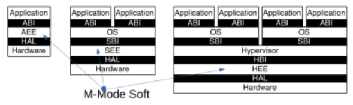

## 2. 实践与实验介绍

### 2.1 循序渐进的操作系统实验

1. **LibOS**：简单嵌入式操作系统
2. **批处理OS**：内存只驻留单道程序，支持系统调用
3. **多道程序OS**：支持多个程序同时驻留内存，并依次执行
4. **分时多任务OS**：支持多个程序**轮流执行**（支持中断处理、上下文切换以及抢占式调度）
5. **地址空间抽象**：进程间内存空间**隔离**，（可以超越物理内存的）**虚拟存储**
6. **进程抽象**：支持**动态创建**、**调度**程序执行，支持多处理器并行
7. **文件抽象**：文件系统
8. **进程间通信**：信号、管道、共享内存、I/O重定向
9. **并发OS**：进程、线程与协程，同步与互斥
10. **管理I/O设备**：支持多种外设，设备抽象；同步与异步I/O

### 2.2 Compiler与OS

源码$$\rightarrow$$汇编码$$\rightarrow$$机器码$$\rightarrow$$执行程序（`bootloader`加载OS执行）

**裸机程序**（*Bare Metal Program*）：与操作系统无关的OS类型的程序。例如计组中编写的小型汇编应用程序。

### 2.3 硬件启动与软件启动

* QEMU启动

  ```bash
  qemu-system-riscv64 \
  	-machine virt \
  	-nographic \
  	-bios ../bootloader/rustsbi-qemu.bin \
  	-device loader, file=target/riscv64-unknown-none-elf/release/os.bin addr=0x80200000
  ```

  其中，`-bios`设置QEMU模拟器开机时用来初始化的**引导加载程序**（bootloader）。`device`的`loader`参数将宿主机上的文件载入到QEMU物理内存的指定位置中。

  启动流程：

  1. 由**固化**在QEMU模拟的计算机内存中的**一小段汇编程序**初始化并跳转执行bootloader。
  2. 由bootloader负责，**初始化并加载OS**，跳转OS执行。
  3. 由**内核**执行初始化工作。

* x86启动流程

  1. *Rom Stage*：在ROM上运行BIOS代码
  2. *Ram Stage*：在RAM（Random Access Memory）上运行代码，检测并初始化芯片组、主板
  3. *Bootloader Stage*：在存储设备上找到Bootloader，加载执行Bootloader
  4. *OS Stage*：Bootloader初始化外设，在存储设备上找到OS，加载执行OS

### 2.4 裸机程序——LibOS

1. **内存布局**

   * `.bss`：存放未初始化的全局变量
   * `.data`：存放程序中已初始化的全局变量
   * `.text`：存放执行代码的内存区域，通常只属于**只读**

2. **函数调用**

   * **Prologue**：保存程序的执行状态（包括保存返回地址寄存器`ra`以及堆栈寄存器`fp`）
   * **Body Part**：函数体
   * **Epilogue**：在执行函数体之后恢复到之前的执行状态

   *Prologue*与*Epilogue*一般由编译器负责实现。

3. **SBI调用**

   **ABI**的一个更加通俗的名字就是**系统调用**。而之所以叫做二进制接口，是因为它和同一种编程语言内部调用的接口不同，是一种汇编指令级的接口。

   **API**与**ABI**的区别：
   
   > * **API**：This is the set of public types/variables/functions that you expose from your application/library.
   >
   >   In C/C++ this is what you expose in the header files that you ship with the application.
   >
   > * **ABI**：This is how the compiler builds an application.
   >   It defines things (but is not limited to):
   >
   >   - How parameters are passed to functions (registers/stack).
   >   - Who cleans parameters from the stack (caller/callee).
   >   - Where the return value is placed for return.
   >   - How exceptions propagate.

   **汇编级SBI调用**

   > **SBI** (Supervisor Binary Interface) is an interface between the Supervisor Execution Environment (SEE) and the supervisor. **It allows the supervisor to execute some privileged operations by using the ecall instruction.**
   
   ```rust
   #[inline(always)]
   fn sbi_call(which: usize, arg0: usize, arg1: usize, arg2: usize) -> usize {
       let mut ret;
       unsafe {
           asm!(
           	"ecall",         // 用于执行系统调用的机器指令
               inlateout("x10") arg0 => ret,
               in("x11") arg1, 
               in("x12") arg2,
               in("x17") which, // SBI编号，对应不同的系统调用
           )
       }
       ret
   }
   ```
   


## 3.基于特权级的隔离与批处理

### 3.1从OS角度看计算机系统

操作系统位于硬件与应用之间。**硬件支持OS**，**OS支持应用**，OS是对硬件的虚拟与抽象。

操作系统对应用的隔离：

1. 对**控制**的隔离：**特权级机制**
2. 对**数据**的隔离：**地址空间**（虚拟内存）
3. 对**时间**的隔离：**中断处理**，随时打断正在执行的用户态App
4. 对**破坏隔离**的处理：**异常处理**

### 3.2从OS角度看RISC-V



RISC-V系统模式包括多个特权级：U（User）、S（Supervisor）、H（Hypervisor）、M（Machine）。`ecall`、`sret`、`mret`等系统调用可以跨越特权级。

**M-Mode**中断的硬件相应过程：

1. 异常/中断指令的PC被保存在mepc中，PC设置为mtvec（异常处理单元的地址）
   * 对于**同步异常**，mepc指向导致异常的指令
   * 对于**中断**，mepc指向中断处理后应该恢复执行的位置
2. 根据异常/中断**来源**设置mcause，并将mtval设置为出错的地址或其他适用于特定异常的信息字
3. 把mstatus[MIE位]置零以**禁用中断**，并**保留先前MIE值**到MPIE中
4. 保留**发生异常之前的权限模式**到mstatus的MPP域中，然后更改权限模式为M
5. 跳转到PC（mtvec设置的地址）继续执行

默认情况下，所有的中断/异常都使得控制权移交到M-Mode的中断/异常处理例程，但RISC-V提供一种**中断/异常委托机制**，通过该机制可以选择性地将中断/异常交给S-Mode处理，而完全绕过M-Mode。

### 3.3批处理操作系统

**批处理**（batch）：自动加载并运行多个程序


## 4.多道程序与分时多任务系统

### 4.1进程和进程模型

#### 4.1.1多道程序与协作式调度

* **多道程序**（Multiprogramming）：在内存中存在**多个**可执行程序，其共享处理器。
* **作业**（Job）：应用的一次执行过程
* **协作式调度**：可执行程序**主动放弃**处理器的使用，而操作系统不会打断正在执行的程序，只会对下一个执行的程序进行选择。

#### 4.1.2分时多任务与抢占式调度

1. **分时多任务**（Time Sharing Multitask）

   * 用户的视角：在内存中存在多个**分时共享**处理器的可执行程序，操作系统按照**时间片**来给各个可执行程序分配CPU使用时间。
   * OS的视角：一个具有一定**独立功能**的程序在一个**数据集合**上的一次动态执行过程称为**进程**，也称为**任务**。从一个应用程序对应的进程切换到另一个应用程序对应的进程称为**进程切换**。

2. **抢占式调度**（Preemptive Scheduling）

   进程**被动地**放弃处理器使用，操作系统可基于时钟硬件中断机制来**随时打断**正在执行的程序。

#### 4.1.3进程

**进程的特点**：

1. **动态性**：不断地“**暂停**”、“**继续**”
2. **并发性**：一段时间内多个进程在执行
3. **有限度的独立性**：进程之间不用感知对方的存在

**进程包含了运行程序的所有状态信息**：

1. 任务执行的**控制流**：包括代码的**内容**与代码的执行位置（代码段）
2. 任务访问的**数据**：被任务读写的内存、寄存器
3. 操作系统管理任务的相关数据：包括任务切换所需的通用寄存器、状态寄存器以及其他信息等。

任务是操作系统**对处于执行状态程序的抽象**。任务=执行中的程序=程序+执行状态。

每个任务在操作系统中都有一个对应的**任务控制块**（TCB），其描述了进程的基本情况以及运行变化的过程。

#### 4.1.4进程模型


### 4.2多道程序与分时多任务操作系统

#### 4.2.1多道程序协作调度

应用程序主动放弃CPU并切换到另一个应用继续执行，从而提高系统整体执行效率。任务的切换涉及到**暂停**与继续，因此需要保存**任务上下文**（Task Context）。

```rust
pub struct TaskContext {
    ra: usize,
    sp: usize,
    s: [usize; 12], // 属于Callee函数保存的寄存器s0~s11
}
```

与函数调用的规范类似，这里只需要保存被调用者保存寄存器。从实现上来说，任务上下文切换与普通的函数调用切换之间的**核心区别**仅仅是**它会换栈**。

与**系统调用上下文**不同，**任务切换**==是来自两个不同应用在内核中的Trap**控制流**之间的切换==，其不涉及**特权级切换**，且只需要保存编译器约定的*callee*函数应该保存的**部分寄存器**，而Trap切换需要保存所有通用寄存器。

> 任务上下文的切换只会发生在特定的时间点，此时编译器会帮助保存特定的寄存器；而Trap的切换可能发生在任一条指令，因此必须保存全部寄存器组。

**Trap控制流切换过程**：

1. 在Trap控制流A调用`__switch()`之前，A的内核栈上只有Trap上下文和Trap处理函数的调用栈信息

2. A在A**任务上下文空间**里保存CPU当前的寄存器快照

3. 读取`next_task_cx_prt`指向的B任务上下文，恢复`ra`寄存器，`s0-s11`寄存器以及`sp`寄存器。此步中，通过**换栈**实现了控制流的切换。

4. CPU执行`ret`后，任务B可以从调用`__switch()`的位置继续向下执行。

   > `__switch()`通过恢复`sp`寄存器换到了任务B的内核栈上，实现了控制流的切换。

#### 4.2.2分时多任务OS

设置**时钟中断**$\rightarrow$在收到时钟中断后统计任务的**使用时间片**$\rightarrow$时间片用完后，切换任务。


## 5.物理内存管理

### 5.1地址空间

* **物理地址**：用于内存芯片级的单元寻址，与处理器和CPU连接的**地址总线**相对应
* **逻辑地址**：**CPU执行机器指令**时，用来指定一个操作数或是一条指令的地址，也即用户编程时使用的地址。
* **线性地址**：也叫虚拟地址。

> 逻辑地址指CPU在**段式内存管理转换前的地址**。
>
> 线性地址指CPU在**页式内存管理转换前的地址**。
>
> 因此，逻辑地址$\rightarrow$线性地址（虚拟地址）$\rightarrow$物理地址。如果CPU没有段式内存管理，那么逻辑地址就是虚拟地址。而如果CPU没有页式内存管理，那么逻辑地址、虚拟地址、物理地址都相同。

**地址生成时机**：

1. **编译时**：起始地址已知的情况
2. **加载时**：编译时起始地址未知，编译器需要生成**可重定位的**代码
3. **执行时**：需**地址转换（映射）硬件**支持

**虚拟存储的作用**：

1. **外存的缓存**：常用数据放在物理内存，不常用数据放在外存。
2. **简化应用编译和加载运行**：每个运行程序具有独立的地址空间，而不管代码和数据在物理内存的实际存放。
3. **保护数据**：独立的地址空间使得区分不同进程各自内存变得容易。

### 5.2内存分配

* **静态内存分配**：指编译时的内存分配，包括全局、静态变量和代码等
* **动态内存分配**：指运行时的内存分配，包括栈上的局部变量，通过`malloc()`和`free()`在堆上申请和释放的内存

#### 5.2.1连续内存分配

连续内存分配指给应用分配一块不小于指定大小的**连续**的内存区域。但是，这种方法会产生**内存碎片**，包括**外碎片**（分配单元**间**未被使用的内存）以及**内碎片**（分配单元**内部**未被使用的内存，例如，操作系统给某一进程分配了一块空间，但其中有一部分该进程无法使用，而操作系统在该进程结束也无法使用这一部分内存）。

1. **动态分区分配**：当程序被加载执行时或运行中数据存储时，分配一个**进程指定大小可变**的分区。三种分配策略如下：

   1. **最先匹配**：使用第一个满足条件的空闲块
   2. **最佳匹配**：使用满足条件的**最小的**空闲块
   3. **最差匹配**：使用满足条件的**最大的**空闲块

2. **伙伴系统**（Buddy System）

   每次分配**满足要求且最小**的大小为$2^U$的内存块，释放时将地址相邻大小相同的空闲块进行合并。可以快速地分配和释放，且**不会产生外碎片**，但是会产生内碎片。

#### 5.2.2非连续内存分配

内核通过**页表**将多个**地址不连续的**物理页转换为**地址连续的**多个虚拟页，可以解决内存分配的**碎片问题**。

**优点**：

1. 允许一个程序使用**非连续**的物理地址空间
2. 允许**共享**代码与数据
3. 允许**动态加载**和**动态链接**

非连续分配需要实现虚拟地址到物理地址的**地址转换**，同时需要考虑如何选择非连续分配中内存块的大小。

* **段式存储管理**

  程序运行的段地址空间由多个段组成，例如，主代码段、子模块代码段、公共库代码段等。==不同段的大小可以不同==。段表位于内存中，由内核管理，与任务/进程对应。

  虚拟地址中由**段号**+**偏移**组成，通过**段号**在段表中查找到对应段的基址与长度，如果偏移超过长度，那么发生异常；否则基址+偏移就是转换后的物理地址。

* **页式存储管理**

  使用页面将地址空间划分为大小相同（$2^n$）的基本分配单位，且物理页面与逻辑页面对应的基本单位大小是相同的。页表位于内存中，由内核管理，与任务/进程对应。

  提高页式存储管理性能的方法：缓存、间接访问（TLB）、多级页表

  **反置页表**：基于**pid+vpn**的Hash映射值查找对应页表项中的物理页号。在反置页表中，所有进程可以公用同一个页表，从而节省空间。

* **段页式存储管理**：将段式与页式存储管理结合，集合二者在内存保护与内存利用和优化转移方面的优点。先查询段表得到该段对应的页表的基址，再查询页表得到物理地址。

### 5.3建立地址空间的OS

* 基于`satp`的虚拟内存系统：

  使用ASID降低上下文切换的开销（通过减少TLB刷新时的开销来实现）。

* **跳板页**`Trampoline`

  跳板页放置在虚拟地址的最高页，应用与内核的跳板页的虚拟地址是相同的，且映射到同一物理页。

  基于跳板页，可实现**特权级**和**地址空间**的平滑过渡。发生陷入时，通过`sscratch`进行应用的用户态栈指针$$\Leftrightarrow$$**陷入上下文**地址切换，随即保存**用户态寄存器**到**陷入上下文**，接着读出**陷入上下文**中的**页表基址**、**应用的内核栈指针**以及`trap_handler`地址，最后**切换页表**，并**跳转到`trap_handler`**。

  其中，应用地址空间的**次高虚拟页面**被设置为存放应用的**陷入上下文**。

  > **Q**：为何不直接把Trap上下文仍放到应用的内核栈中呢？
  >
  > **R**：访问内核栈中的Trap上下文，需要先切换页表；然而页表信息存放在Trap上下文中，造成了逻辑循环。

* **逻辑段**：

  ```rust
  pub struct MapArea {
      vpn_range: VPNRange, //一段虚拟页号的连续区间
      data_frames: BTreeMap<VirtPageNum, FrameTracker>,//VPN<-->PPN映射关系
      map_type: MapType, //映射类型
      map_perm: MapPermission, //可读/可写/可执行属性
  }
  ```

  `data_frames`是一个保存了该逻辑段内的每个虚拟页面和它被映射到的物理页面的一个键值对容器。

  ```rust
  pub struct MemorySet {
      page_table: PageTable, // 页表
      areas: Vec<MapArea>, //一系列有关联的不一定连续的逻辑段
  }
  ```

  操作系统管理的**地址空间** `MemorySet = PageTable + MapAreas`。


## 6.虚拟存储管理

### 6.1虚拟存储概念

* **覆盖**：把一个程序划分为一系列功能相对独立的程序段，让执行时不要求装入内存的程序段组成一组（称为**覆盖段**），**共享**主存的同一区域。

  1. **必要**部分（常用）的代码和数据常驻内存
  2. **可选**部分（不常用）的放在其他程序模块中，只在**需要时**装入内存
  3. **不存在调用关系**的模块可相互覆盖，共用同一块内存区域

  通过覆盖技术，可以在有限的物理内存中运行大小超过物理内存大小的程序，但是需要程序员手动划分功能模块，并确定模块间的覆盖关系，增加了编程的复杂度。

* **交换**：操作系统以**程序**为单位**自动**换入换出内存，只当内存空间不够或有不够的可能时才换出。

* **虚拟页式存储**：在页式存储管理的基础上，增加**请求调页**和**页面置换**

  1. 当用户程序要装载到内存时，只装入**部分**页面，就启动程序运行
  2. 用户程序在运行中发现有需要的代码或数据不在内存时，则向系统发出**缺页异常**请求
  3. 操作系统在处理缺页异常时（首先通过`MemoryArea`判断是否合法），将外存中相应的页面**==调入==**内存，使得用户程序能继续运行
  4. 当内存快用完时，操作系统把部分页从内存**==调出==**到外存。

  对于未被映射的页，其被存储在**交换空间**或**磁盘上的文件**中。

* **虚拟存储的性能**

  有效存储访问时间(EAT)=内存访问时间$$\times(1-p)$$+缺页异常处理时间

  缺页异常处理时间=磁盘访问时间$$\times p(1+q)$$

  其中，$$p$$表示缺页率，$$q$$表示写回概率。

### 6.2局部页面置换算法

* **页面置换**：到达下限，开始回收内存；到达上限，暂停回收内存。对于不同的页面置换算法，**更少的缺页**意味着更好的性能。
* **页面锁定/常驻内存**：某些逻辑页面必须常驻内存，例如操作系统的关键部分

#### 6.2.1最优页面置换算法（OPT）

基本思路：置换在**未来最长时间不访问**的页面。

#### 6.2.2先进先出页面置换算法（FIFO）

基本思路：置换在**内存驻留时间最长**的页面。

维护一个记录所有位于内存中的逻辑页面的链表，链表元素按照驻留内存的时间排序，出现缺页时，选择**链首**页面进行置换，新页面加到**页尾**。

当分配的物理页面数增加时，**缺页不一定减少**（Belady现象）。

#### 6.2.3最近最久未使用算法（LRU，Least Recently Used）

基本思路：置换**最长时间没有被引用**的页面。其试图通过页面过去的访问时间来“预测”其下一次的访问时间，是最优页面置换算法的一种近似。

> 操作系统实际并无方法直接实现LRU算法，原因在于，操作系统没有办法知道每次内存访问的页面，只有在发生缺页异常时，硬件才会通知操作系统进行页面调换。

如果页面进入内存后不会再被访问，那么LRU就会退化成FIFO。

#### 6.2.4时钟页面置换算法（Clock）

是**FIFO**算法与**LRU**算法的一种**折中**，其仅对页面的访问情况进行大致统计。其在页表项中增加**访问位**（Access位），来描述页面在过去一段时间的内访问情况，各页面组织成**环形链表**，指针指向**最先调用**的页面。访问页面时，将Access位置1，缺页时，从指针当前位置**顺序检查**，若当前Access位为0，则置换该页，**指针指向下一页**；若Access位为1，则将其置为0，并继续移动指针，直到找到可置换的页面为止。

#### 6.2.5改进的时钟页面置换算法

基本思路：减少**修改页**的缺页处理开销。对于**脏页**，其被置换时需要额外进行写回的操作，因此置换开销较大。在页表项中增加**修改位**，描述页面在过去一段时间内的**写访问**情况。缺页时，修改页面标志位，**跳过有修改的页面**。

考虑$(使用位,修改位)$，指针扫过后的替换为：
$$
\begin{cases}
00\rightarrow\texttt{置换}\\
01\rightarrow00\\
10\rightarrow00\\
11\rightarrow01
\end{cases}
$$

#### 6.2.6最不常用置换算法（LFU，Least Frequently Used）

基本思路：置换**访问次数最少**的页面。

通过给每个页面设置一个访问计数来实现，访问页面时计数加一，缺页时置换计数最小的页面。LFU存在一个问题，开始时频繁使用而以后不使用的页面**很难置换**。因此，可以通过**计数定期右移**来解决这一问题。

#### 6.2.7Belady现象

采用FIFO等算法时，可能出现**分配的物理页面数增加，缺页次数反而升高**的异常现象。这是因为，FIFO算法的置换特征与进程访问内存的动态特征矛盾，被其置换出去的页面并不一定是进程近期不会访问的。

而对于LRU算法，当分配的物理页面数增加时，其驻留在内存中的页面集合存在“包含”关系，因此其不存在Belady现象。

### 6.3全局页面置换算法

局部页面置换算法考虑的是单个进程内部的页面替换，而没有考虑到进程访存的差异。全局页面置换算法关注的就是**给不同的进程分配不同数量的物理页面**。进程在不同阶段的内存需求是变化的，因此分配给进程的内存也需要在不同阶段有所变化。

#### 6.3.1工作集页面置换算法

一个进程$$\Delta$$时间内使用的逻辑页面的集合，可表示为二元函数$$W(t,\Delta)$$，表示当前执行时刻$$t$$，工作集窗口$$\Delta$$，工作集大小$$|W(t,\Delta)|$$为集合中的页面数目。

进程开始执行后，随着访问新页面逐步建立较稳定的工作集。当内存访问的**局部性区域为止大致稳定**时，工作集大小也大致稳定。当**局部性区域位置改变**时，工作集会**快速扩张和收缩过渡到下一个稳定值**。

当前时刻中进程**实际驻留内存**的页面集合称为**常驻集**。常驻集取决于**操作系统分配给进程的物理页面数目也即页面置换算法**。工作集页面置换算法的目的是让常驻集与工作集尽量保持一致，从而**提高整体（而非单个进程）的效率**。

工作集页面置换算法维护一个窗口内的访存页面链表，**每次访存**时，**换出不在工作集的页面**，更新访存链表；缺页时，**换入页面**，更新访存链表。

#### 6.3.2缺页率页面置换算法

通过调节常驻集的大小，使**每个进程的缺页率保持在一个合理的范围内**。若进程缺页率过高，则增加常驻集以分配更多的物理页面；若进程缺页率过低，则减少常驻集以减少它的物理页面数。

访存时，设置引用位的标志，缺页时，计算从上次缺页时间到现在时间的**时间间隔**，如果这一间隔大于一个时间阈值（说明缺页率过低），则置换所有在这一时间段内没有被引用过的页；如果这一间隔小于时间阈值（说明缺页率过高），则增加缺失页到常驻集中。

#### 6.3.3抖动问题（Thrashing）

随着驻留内存的进程数目增加，分配给每个进程的物理页面数不断减小，造成**大量缺页**，频繁置换，缺页率不断上升。因此，操作系统需要在**并发水平**和**缺页率**之间达到一个平衡，选择一个适当的进程数目和进程需要的物理页面数。


## 7.进程管理与单处理器调度

### 7.1进程管理

#### 7.1.1进程的基本概念

操作系统通过进程来有效**管理和调度**多个程序的执行和对资源的使用，因此，进程也可以理解为程序执行中**占用资源的集合**。操作系统建立与运行中的程序**管理**相关的数据结构，并对其进行动态操作。

进程提供给应用程序两种关键**抽象**：

1. **独立的逻辑控制流**：好像自己的程序独占地使用处理器
2. **私有的地址空间**：好像自己的程序独占地使用内存系统

进程的定义：**一个具有一定独立功能的程序在某数据集合上的一次执行和资源使用的动态过程**。

> **任务**和**进程**的不同点：任务可以理解为进程的**初级阶段**，其不能在运行的过程中进行创建子进程、用新的程序内容覆盖已有的程序内容等功能，也不能动态申请、使用、释放各种资源的载体。

#### 7.1.2进程管理

进程管理系统调用：`fork()`，`exec(char *file)`，`exit(int status)`，`waitpid(int pid, int *status)`，`int getpid()`。

* **进程控制块PCB**

  包括进程id，进程状态，父子关系，退出码，进程上下文（包括陷入上下文、任务上下文、地址空间、进程内核栈）

* **进程切换**：切换前，**保存**进程上下文；切换后，**恢复**进程上下文

* **进程创建和程序加载**：

  1. `fork()`把一个进程复制成两个进程，复制父进程的所有变量和内存，同时复制父进程的所有CPU寄存器（除了存放返回值的寄存器，父进程中`fork()`返回子进程的`pid`，子进程中`fork()`返回0）
  2. `exec()`加载新程序来重写当前运行进程

* **进程等待与退出**：

  `wait()`系统调用用于父进程等待子进程结束，子进程结束时通过`exit()`向父进程返回一个值，父进程通过`wait()`接受并处理返回值。如果有子进程存活，父进程调用`wait()`会进入等待状态，当相应子进程调用`exit()`时，会唤醒父进程。

  * **僵尸进程**：已经`exit`但是还没有被父进程通过`wait`**回收其进程控制块**的子进程
  * **孤儿进程**：其**父进程先退出**的子进程，孤儿进程由root进程负责等待并回收。

  `exit()`系统调用在进程执行时调用，完成进程大部分的资源回收，包括关闭所有打开的文件等占用资源，释放内存，释放大部分进程相关的内核数据结构，**保留结果的值（进程控制块）**，同时检查父进程是否存活，若否，设置父进程为root进程。在此之后，会进入**僵尸**状态，等待被父进程回收。

#### 7.1.3关于`fork()`的思考

如果对内存等资源进行全部复制，开销会非常大。然而，在99%的情况里，我们调用完`fork()`后就会调用`exec()`，因此内存复制是无用的。通过`vfork()`可以实现这样一种轻量级的`fork()`调用（不复制内存，因此子进程应该几乎立即调用`exec()`）。

现在也使用*Copy on Write*技术来减少内存复制的开销。

### 7.2单处理器调度

#### 7.2.1处理机调度概念

处理机调度：从就绪队列中挑选下一个占用CPU运行的进程；从多个可用CPU中挑选就绪进程可使用的CPU资源。

**比较调度算法的准则**：

* **CPU使用率**：CPU处于忙状态的时间百分比
* **吞吐量**：单位时间内完成的进程数量
* **周转时间**：进程从初始化到结束（**包括等待**）的总时间
* **就绪等待时间**：就绪进程在就绪队列中的总时间
* **响应时间**：从提交请求到产生响应所花费的总时间
* **公平**：进程占用的资源，例如CPU时间

#### 7.2.2调度算法

1. **先来先服务调度算法FCFS**

   依据进程进入就绪状态的先后顺序进行排列，进程进入等待或结束状态时，就绪队列中的下一个进程就占用CPU。缺点为平均等待时间的波动较大。

2. **短作业优先调度算法SJF**

   将就绪队列按照预期的执行时间进行排序，选择就绪队列中**执行时间最短**的作业/进程占用CPU进入运行状态。SJF可以缩短平均等待时间，但可能导致**饥饿**，也即连续的短作业/进程流会使长作业/进程无法获得CPU资源。并且，其需要预估作业/进程占用CPU的时间。
   
   可以用**历史的**执行时间来预估未来的执行时间，即：
   $$
   \tau_{n+1}=\alpha t_n+(1-\alpha)\tau_n,\quad0\leq\alpha\leq 1
   $$
   其中$$t_n$$表示第$$n$$次的CPU计算时间，$$\tau_n$$表示第$$n$$次CPU计算时间的**预估**。
   
3. **最短剩余时间算法SRT**

   **SRT**为一种抢占式调度机制，即有新进程就绪且**新进程的服务时间小于当前进程的剩余时间**，则转到新的进程执行。

4. **最高响应比有限算法HRRN**

   该算法是对FCFS调度算法和SJF调度算法的一种综合平衡，同时考虑每个作业的**等待时间**和**估计的运行时间**。响应比R计算如下：
   $$
   R=\frac{w+s}{s}
   $$
   其中$$w$$表示**就绪等待时间**，$$s$$为**预期的执行时间**。其关注了进程的等待时间，防止进程执行被无限期推迟。

5. **时间片轮转算法RR**

   **时间片**为分配处理机资源的基本时间单元。每个时间片结束或进程主动放弃处理器资源时，按照FCFS算法切换到下一个就绪的进程。

   对于RR算法，虽然保证了进程执行的公平，但是开销比较大。如果**时间片太大**，则极限情况下会退化成FCFS；而如果**时间片太小**，虽然反映迅速，但是会==产生大量的上下文切换==。

6. **多级队列调度算法MQ**

   MQ（MultiQueue），其将**就绪队列**划分成多个**独立的子队列**，而每个队列拥有自己的调度策略，例如，前台进程（交互）子队列采用RR调度，而后台进程（批处理）子队列由于时间片大，采用简单的FCFS调度。

   队列间的调度可以采用**固定优先级**（先处理前台进程，再处理后台进程）或**时间片轮转**（每个队列都得到一个确定的能够调度其进程的CPU总时间）的策略。

7. **多级反馈队列调度算法MLFQ**

   MLFQ（Multi-Level Feedback Queue），在优化**周转时间**的同时**降低响应时间**。

   调度规则：

   1. 如果A的优先级>B的优先级，则运行A；若A的优先级=B的优先级，则采用轮转/FIFO的方式运行A和B

   2. 工作进入系统时，放在最高优先级

   3. 如果进程在当前的时间片没有完成，则**降到下一个优先级**

   4. 如果工作在其时间片内**主动释放**CPU，则优先级不变

   5. 时间片大小随优先级级别增加而增加

   6. 经过一段时间S，**就将系统中所有工作重新加入最高优先级队列**

      > 如果只有优先级的下方而没有上升，则可能会妨碍某些原先是CPU密集型后续转化为IO密集型的工作，因此需要隔一段时间“重启”。

8. **公平共享调度算法FSS**

   FSS（Fair Share Scheduling），其从**用户**的粒度来考虑调度问题，按照**用户优先级**分配资源，保证重要的用户可以占用资源，不重要的用户无法垄断资源。而对于未使用的资源，进行按照比例分配。

### 7.3实时调度

**实时操作系统**：正确性依赖于**时间**和**功能**两方面的操作系统。其考虑的更多是**时间约束的及时性**（也即是否在deadline前完成任务），速度和平均性能相对不重要。

* **强/硬实时操作系统**：要求在指定时间内必须完成重要的任务
* **弱/软实时操作系统**：重要进程有高优先级，要求尽量但并非必须完成
* **硬时限**：错过任务时限会导致灾难性的后果，必须满足
* **软时限**：尽力保证满足，如有时不能满足，则降低要求

**周期实时任务**：一系列相似的、有规律地重复的任务。其中周期$$p$$为任务请求时间间隔，执行时间$$e$$，使用率$$U=e/p$$。

#### 7.3.1实时调度算法

* **速率单调调度算法**（RM，Rate Monotonic）

  属于**静态优先级调度**，通过周期安排优先级，周期越短优先级越高，优先执行周期最短的任务。但是，固定优先级可能导致有的任务错过期限。

* **最早截止时间优先算法**（EDF，Earliest Deadline First）

  **截止时间**越早优先级越高，优先执行离截止时间最近的任务。

* **最低松弛度优先算法**（LLF，Least Laxity First）

  根据**任务紧急或者松弛程度**来确定任务的优先级，任务的紧急度越高，优先级越高。其中**松弛度=必须完成时间-本身还需要运行时间-当前时间**。

#### 7.3.2优先级反置

**优先级反置**，指高优先级进程长时间等待低优先级进程所占用资源的现象。

例如，假设低优先级进程T3占用资源s，后中优先级进程T2抢占T3。而此时高优先级进程T1申请运行及资源3，由于T2长时间运行**阻碍了**低优先级的T3释放s，导致**高优先级的T1等待与其运行无关的低优先级进程T2**。

* **优先级继承**：占有资源的低优先级进程==继承==**申请资源**的高优先级进程的优先级。**只有在占有资源的低优先级进程被阻塞时**，才提高占有资源进程的优先级。
* **优先级天花板协议**：占用资源进程的优先级与**所有可能**申请该资源的进程的**最高优先级**相同。这里，不管是否发生等待，都提升占用资源的进程的优先级。但是，对于恶意进程，其可能通过申请资源来恶意提高自己的优先级。


## 8.多处理器调度

### 8.1对称多处理与多核架构

* **单核处理器**
* **超线程处理器**：寄存器、程序计数器独立，算数计算单元等硬件公用。其适合IO密集型的任务，而不适合计算密集型任务。
* **多核处理器**
* **众核处理器**

### 8.2Cache一致性

